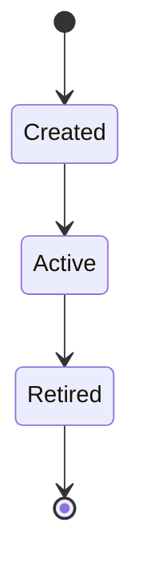

# archagent

Keep your codebase adherent to a described architecture — and teach your coding agent
to reason about it.

You describe the architecture as markdown in your repo (including a table of machine-checkable
**invariants**). archagent generates configs for existing tools (import-linter, dependency-cruiser,
ast-grep) from that single source and runs them, reporting adherence per invariant. The checkers
are deterministic; the LLM only ever *proposes*.

**It enforces the rules you already wrote down.** Design docs and code are full of stated invariants —
`# INVARIANT: the query set is always sorted`, "summaries must never be empty", "only the config layer
reads the environment" — that nothing checks. `archagent scan-invariants` finds them across your docs and
code, and the `describe` skill classifies each, verifies it against the code, and lifts it into the
enforceable table. Intent that was buried in prose becomes a checked rule — and a stated rule the code
*violates* is surfaced as drift (a real bug, or a stale design).

> Status: early. v1 covers BOUNDARY invariants (Python via import-linter, JS/TS via dependency-cruiser),
> STRUCTURAL invariants (any language via ast-grep, path-scopable), and a PBT tier for behavioral/data
> invariants (Python via Hypothesis) — all driven by `architecture/invariants.md`, plus per-agent
> delivery for Claude Code, Cursor, and OpenHands.

## Install

archagent installs once (from outside your repos) and scaffolds into each project (like Spec-Kit).
Install it from PyPI:

```bash
uv tool install archagent          # gives you an `archagent` command
# or run without installing:
uvx archagent init .
```

Prefer the latest unreleased code? Install from the repo instead:

```bash
uv tool install git+https://github.com/BenedatLLC/archagent
```

Then run it inside a project (see **Workflow** below).

## Upgrading

The prompts (agent skills + `architecture/AGENTS.md`) ship inside the archagent package, so upgrading is
**two steps**: update the tool, then refresh the repo.

1. **Update the archagent tool:**
   ```bash
   uv tool upgrade archagent                                   # installed from PyPI or GitHub
   # or, from a local checkout:
   git -C /path/to/archagent pull && uv tool install --force /path/to/archagent
   ```
2. **Refresh the repo's prompts:**
   ```bash
   cd your-repo
   archagent upgrade      # refreshes the skills + architecture/AGENTS.md only; leaves your
                          # archagent.toml and architecture content untouched (--agents to pick which)
   ```
3. **Restart your coding-agent session** so it reloads the updated skills (`/skills` in Claude Code to confirm).

> `archagent upgrade` alone won't help if the installed tool is stale — the prompts come from the package,
> so do step 1 first. Don't use `archagent init --force` to upgrade: it re-scaffolds everything and would
> overwrite your `invariants.md` and other authored content.

## The architecture artifact

`init` scaffolds an `architecture/` directory in your repo — plain markdown, versioned in git, the
shared source of truth that both humans and agents read and write:

| File | Tier | What it holds |
|------|------|---------------|
| `constitution.md` | hot (always loaded) | terse conventions + the handful of patterns the system relies on, and how to work here |
| `invariants.md` | hot | the **single source of truth** for checkable rules (the table archagent parses) |
| `subsystems/<name>.md` | cold (on demand) | one doc per subsystem, the narrative architecture across the six dimensions |
| `decisions/NNNN-*.md` | cold | ADRs — the *why* behind decisions, and the rejected alternatives |
| `index.md` | hot | catalog of the docs |
| `log.md` | — | append-only, chronological change log (grep/tail friendly) |
| `deployment.md` | cold | deployment view (services/runtimes/infra) + configuration (the `**Config:**` env-key manifest) |
| `AGENTS.md` | — | how to work with archagent in this repo (archagent-owned; refreshed by `upgrade`) |

Two tiers, on purpose: the **hot** files are loaded into the agent every session, so they stay terse.
The **cold** files (subsystem docs, ADRs) are retrieved only when relevant, so they can be full
narrative — written so a new engineer can learn a subsystem by reading one doc, without chasing links.

## How architecture is modeled

Each subsystem is described across **six dimensions** (in `subsystems/<name>.md`):

1. **Process topology & components** — what the pieces are, how they connect, the entry points.
2. **Key abstractions & patterns** — the few patterns the system leans on, each with a concrete example.
3. **State & tiering** — what state exists and *where* it lives: in-memory, durable files, a database,
   a cache, a vector store. The storage tiers are made explicit.
4. **Lifecycles** — how components and state move through their states over time, as a **Mermaid
   `stateDiagram`** with a plain-language caption. State machines live here.
5. **Key flows** — the important end-to-end paths, as a **Mermaid `sequenceDiagram`** with a caption.
6. **System-wide invariants** — what must always hold; the checkable ones are linked to `invariants.md`.

Diagrams are text (Mermaid), so they diff cleanly and an agent can read and edit them. The *why*
behind any non-obvious choice goes in an ADR under `decisions/`, which invariants link to.


_A lifecycle is a state machine + a one-line caption: what it shows and the key takeaway._

**System-level view.** The six dimensions describe each subsystem in isolation; the *cross-cutting* view —
how the system is deployed and configured — lives in `deployment.md`:

- **Deployment topology** — the services / runtimes / infra the system runs as (read from
  `docker-compose` / k8s / `Procfile`), listed under a `**Services:**` manifest.
- **Configuration** — the environment keys the system reads, declared under a `**Config:**` manifest (or a
  committed `.env.example`). This is where configuration is modeled: `drift` compares the keys actually
  read in code (`os.getenv`, `process.env`) against what's declared, and a config-access boundary can be
  enforced as an invariant (e.g. only a `config` module may read the environment).

These tie back to the subsystems through a few optional metadata fields on each `subsystems/<name>.md`:
`**Covers:**` (the code it owns), `**Service:**` (which deployment service it runs as), `**Tier:**` (its
layer), and `**Connects:** … via <kind>` (its dependencies, typed by connector — `import` / `sync-call` /
`async-event` / `shared-data` / `pipe`). `drift` and `evaluate` read these to check topology, layering,
data ownership, and deployment coupling.

## Invariants are a markdown table

`architecture/invariants.md` — the first table is parsed; the prose around it is for humans:

| ID | Type | Tier | Applies-to | Rule | Severity | Why | Status |
|----|------|------|-----------|------|----------|-----|--------|
| BND-001 | BOUNDARY | structural | python | `forbid app.domain -> app.web` | error | [0007](decisions/0007-hexagonal.md) | active |
| BND-010 | BOUNDARY | structural | ts | `forbid src/domain -> src/ui` | error | [0008](decisions/0008-layers.md) | active |
| STR-002 | STRUCTURAL | structural | python | `forbid-pattern print($$$)` | warn | [0009](decisions/0009-no-io.md) | active |

- **Type** (the dimension it protects): BOUNDARY · INTERFACE · DATAFLOW · STRUCTURAL · PURPOSE.
- **Tier** (how it's enforced, cheapest first): structural · contract · pbt · model-check.
- **Rule** (compact DSL):
  - `forbid <a> -> <b>[, <c>...]` — BOUNDARY (must not import *directly*).
  - `forbid-pattern <ast-grep pattern> [in|outside <scope>]` — STRUCTURAL (a code shape that must not
    appear). `in <scope>` flags matches only there; `outside <scope>` flags everywhere *except* there
    (the "only `<scope>` may do this" case). `<scope>` is a path/glob (`src/app/domain`) or a dotted
    module (`app.domain.workflow`); omit it to scan all sources.
  - `property <path::test>` — a **behavioral / data invariant** ("all state is per-user", round-trip
    properties) checked by a **property-based test**. The target's file extension picks the framework:
    `.py` → a Hypothesis `@given` stub, a JS/TS file → a **fast-check** `fc.property` stub. `check` runs it
    in the *project's* env (`[python] test_command` / `[ts] test_command`) and reports the counterexample.
  - `property stateful <path::TestCase>` — for **stateful** systems (state machines, stores, lifecycles):
    a Hypothesis `RuleBasedStateMachine` (Python) or a fast-check `fc.commands` model-based stub (JS/TS) —
    random operation sequences checked against invariants, the right tool for state/data-layer bugs.
- **Severity**: `error` fails `check`; `warn` is reported but doesn't fail.
- **Why**: a link to the ADR with the rationale.

## How it works

```
architecture/invariants.md  ──gen──▶  checker configs  ──check──▶  per-invariant report
      (single source)            (existing tools = the diff)        (PASS / WARN / FAIL)
```

archagent doesn't reimplement architecture checking — it compiles your invariant table into configs for
tools that already do it, and maps their results back to invariant IDs. The capability matrix picks the
tool per `(invariant tier × language)`:

| Tier / invariant | Python | JS / TS |
|------------------|--------|---------|
| BOUNDARY / layering | import-linter | dependency-cruiser |
| STRUCTURAL (code shape) | ast-grep | ast-grep |
| PBT (behavioral / data) | Hypothesis | fast-check |

Adding a language is adding a column, not rewriting anything. Generated configs live under
`.archagent/generated/` and are gitignored — they're derived from the table and regenerated on every
`check`.

## Workflow

**Set up the architecture (once per repo):**

1. **`archagent init .`** — scaffold `archagent.toml`, the `architecture/` templates, and the phase
   skills. It **auto-detects which agents you use** (`.claude/`, `.cursor/`, `.openhands/`) and installs
   skills for those; override with `--agents claude,cursor` / `all` / `none`. It also detects languages
   and guesses `root_package` / `source_paths` — check those in `archagent.toml`. It **never creates or
   overwrites your top-level `CLAUDE.md` / `AGENTS.md`**; the full instructions go in
   `architecture/AGENTS.md`. Add `--wire` to append a small additive pointer to your top-level file(s).
2. **`/archagent-describe`** (in your coding agent) — document the *current* architecture: it locates your
   docs (via README/`AGENTS.md`/`CLAUDE.md` and any `designs/`/`spec/` dirs), **verifies them against the
   code**, and writes the constitution, the per-subsystem docs (the six dimensions), and an initial set of
   invariants — including ones it **mines from your existing design docs and code** (`archagent
   scan-invariants` surfaces the candidates; see below).
3. **`archagent check`** (or `/archagent-check`) — verify the code against those invariants.

**Keep it honest as you work:**

- **Every commit / PR** — `archagent check` (wire into pre-commit + CI) gates changes against the invariants.
- **Add an invariant** — **`/archagent-invariant`**, or edit `architecture/invariants.md` by hand, to
  encode a new rule (from a design decision, or lifted from a subsystem doc); `check` confirms it catches
  the right thing.
- **Mine stated invariants** — `archagent scan-invariants` surfaces rules already written in your docs and
  code (`INVARIANT:` markers, asserts/contracts, and modal prose like "must never" / "only X may"); the
  `describe` skill classifies each, verifies it, and lifts the checkable ones into the table (capturing the
  rest as cited prose rows).
- **See what drifted** — `archagent drift` reflexion-diffs the `architecture/` docs against the code:
  **dangling references**, **stale docs** (git), **undocumented modules** (via `**Covers:**`),
  **undeclared/stale subsystem dependencies** (declared `**Connects:**` `import`-kind edges vs the actual
  import graph), **undocumented entry points**, the **web-route surface** (Flask/FastAPI/Django routes vs a committed
  OpenAPI spec, else the docs), **configuration** (env keys read vs a `.env.example` / `**Config:**`
  manifest), **deployment topology** (IaC services vs a `**Services:**` list), and **connector-kind
  mismatches** (a `**Connects:** … via async-event` the code contradicts with a blocking HTTP call).
  Informational — its
  output (`--json` for tooling) is the update work-list.
- **Evaluate the architecture** — `archagent evaluate` (or **`/archagent-evaluate`**) judges the *model
  itself* for **system-level** smells and recommends fixes: **data & source-of-truth** (shared persistency,
  duplicated ownership, cross-service data intimacy, shared libraries — via `**Service:**` maps),
  **shotgun surgery** and **unstable interfaces** (from git **co-change** history), **God Components**,
  **circular subsystem/service dependencies** (with shape + severity), **unstable dependencies** (Martin's
  `I = Ce/(Ca+Ce)`), **leaky abstractions** (layer inversion/skip, via `**Tier:**`), **distributed monolith**
  (a synchronous service cycle — from typed `**Connects:**` edges *and* sync-call edges inferred from the
  code, so it works with no annotation) and **extraneous adjacent connectors**,
  **hard-coded endpoints**, and **cross-boundary observability** (services that call each other but can't
  trace a request across the boundary). It emits *candidate* signals (`--json`); the skill judges them in
  context, clusters to roots, and prioritizes. Advisory (not a commit gate). Runs at design-review +
  periodically.
- **Update the architecture** (a new design, or the code changed) — re-run **`/archagent-describe`**:
  it's *build-**or-update***. Start from `archagent drift` (reconcile doc-vs-code), then `archagent evaluate`
  (assess system-level health); refresh the subsystem(s) that changed and reconcile the invariants. Drift
  items are record fixes; evaluate findings are design decisions — change the structure or accept it with an
  ADR, and graduate the fixes you want to hold into `check` invariants. Do this at **design-review time**
  (does the proposed design fit — and does it introduce a smell?) and **periodically** as the code evolves;
  record decisions as ADRs in `architecture/decisions/`.
- **Upgrade the prompts** — update the tool, then `archagent upgrade` (refreshes the skills +
  `architecture/AGENTS.md` only, leaving your config and architecture content untouched). See
  [Upgrading](#upgrading).

> Cadence: `describe` + `evaluate` at design-review + periodically; `check` on every commit. archagent
> enforces *your system's* design rules and flags *system-level* smells (candidates its skill judges in
> context) — it isn't a generic metrics dashboard (cycle counts, coupling scores).

The three skills (`describe`, `check`, `invariant`) come from one neutral source and are installed per
agent — Claude Code `.claude/skills/`, Cursor `.cursor/skills/`, OpenHands `.openhands/microagents/` — plus
`architecture/AGENTS.md` (the full instructions, archagent-owned). In Claude Code, invoke a skill directly
as `/archagent-describe` (etc.) or just describe the task and Claude activates it.

## Commands

CLI:
- `archagent help` — concise overview of the lifecycle and the command/skill for each step.
- `archagent init [PATH]` — scaffold `archagent.toml` + `architecture/` templates + agent skills.
  Auto-detects agents (`--agents auto`); override with `--agents claude,cursor` / `all` / `none`.
  `--wire` adds an additive pointer to top-level `CLAUDE.md`/`AGENTS.md`; `--force` re-scaffolds everything.
- `archagent check` — regenerate configs, run the checkers, report per invariant (exit 1 on an
  error-severity failure).
- `archagent drift` — reflexion-diff the `architecture/` docs against the code: dangling references,
  stale docs (git), undocumented modules (via `**Covers:**`), undeclared/stale subsystem dependencies
  (declared `**Connects:**` `import`-kind edges vs the actual import graph — Python `ast` + JS/TS regex), undocumented entry
  points (`[project.scripts]` + `package.json` `bin`), the **web-route surface** (Flask/FastAPI/Django +
  Express/Fastify/NestJS, static, vs a committed OpenAPI spec if present, else the docs), and
  **configuration** (env keys read in code vs a `.env.example` / `**Config:**` manifest), and **deployment
  topology** (services from docker-compose/Procfile/k8s vs a `**Services:**` list, plus code cross-service
  dependencies vs compose `depends_on` via subsystem `**Service:**` mappings), and **connector-kind
  mismatches** (declared `via async-event` vs a synchronous HTTP call inferred from the code). Informational; `--json` for
  tooling/agents, `--exit-code` to fail CI on any drift.
- `archagent evaluate` — judge the architecture for **system-level** smells (candidates for
  `/archagent-evaluate`): **data & source-of-truth** (shared persistency, duplicated ownership, cross-service
  data intimacy, shared libraries — from a static datastore→service map via `**Service:**`), God Components,
  circular subsystem/service dependencies (shape + severity), unstable dependencies (`I = Ce/(Ca+Ce)`,
  `DoUD ≥ 0.30`), leaky abstractions (layer inversion/skip via `**Tier:**`), **distributed monolith** +
  **extraneous adjacent connectors** (from typed `**Connects:**` edges), hard-coded service endpoints, and
  **cross-boundary observability** (no request tracing across services); plus **git co-change** signals
  (**shotgun surgery** / implicit coupling, **unstable interface**). `--json`, `--group A|B|C|D`,
  `--min-severity`, `--no-history`, `--since`, `--exit-code`.
- `archagent scan-invariants` — scan docs + code for **stated invariants** (explicit `INVARIANT`/
  `@invariant`/assert/contract markers, plus modal language like MUST/NEVER/"only X may") and emit them as
  candidates for `/archagent-describe` to classify, verify, and lift into `invariants.md`. `--json`,
  `--markers-only`.
- `archagent gen` — regenerate only the checker configs from `architecture/invariants.md` (`check` does
  this for you).
- `archagent upgrade` — refresh the archagent-owned prompts (skills + `architecture/AGENTS.md`) to the
  latest; leaves your config and architecture content untouched.

Agent skills (invoke in your coding agent; Claude Code slash form shown):
- `/archagent-describe` — build or update the architecture artifact.
- `/archagent-check` — run `archagent check` and resolve violations.
- `/archagent-invariant` — add or change a checkable invariant.
- `/archagent-evaluate` — judge the architecture for system-level smells and recommend fixes.
- `/archagent-help` — overview of the lifecycle and which command/skill to use at each step.

## Configuration

A small `archagent.toml` at the repo root tells archagent where the code is:

```toml
[project]
languages = ["python", "ts"]

[python]
root_package = "app"
source_paths = ["src"]

[ts]
source_paths = ["src"]
```

## Try it

```bash
uv run archagent check --project examples/sample_py    # Python (import-linter + ast-grep)
uv run archagent check --project examples/sample_ts    # TS (dependency-cruiser + ast-grep)
```

## What it composes

import-linter (Python boundaries) · dependency-cruiser (JS/TS boundaries) · ast-grep (structural,
any language) · grep/git for retrieval and history. archagent is the thin layer that turns one
markdown table into those tools' configs and reports results per invariant.

## Repository layout

The layout of this source repository (distinct from the `architecture/` artifact archagent *generates* in
a target repo, described above):

```
archagent/
├── README.md                 this file
├── pyproject.toml            package metadata + dependencies (uv)
├── docs/
│   ├── ROADMAP.md            planned future work, grouped by theme (checkable)
│   ├── ADL-SPEC.md           the architecture-artifact format, as a standards-style spec
│   └── RELEASING.md          how to cut a new release to PyPI
├── src/archagent/
│   ├── cli.py                the `archagent` CLI (init · gen · check · drift · evaluate · upgrade)
│   ├── config.py             archagent.toml loading (languages, source paths, test commands)
│   ├── invariants.py         parse the invariants.md table  ·  rules.py — the Rule DSL
│   ├── generate.py           compile invariants → checker configs  ·  check.py — run them, map results
│   ├── init.py               scaffold the artifact + per-agent skills; upgrade prompts
│   ├── drift.py              the reflexion-diff (docs vs code): the `drift` command
│   ├── evaluate.py           system-level architecture smells: the `evaluate` command
│   ├── <extraction scanners> configscan · deployscan · webapi · datamap · cochange · connscan · obsscan
│   │                         (static, no-execution extractors: env keys, IaC, routes, datastores,
│   │                          git co-change, connector kinds, observability)
│   └── templates/
│       ├── architecture/     the artifact scaffold (constitution, invariants, subsystems, deployment…)
│       └── agent/phases/     the neutral skill prompts (describe · check · invariant · evaluate)
├── examples/                 sample_py, sample_ts — end-to-end fixtures
├── tests/                    the pytest suite
└── .github/workflows/ci.yml  CI (runs the suite on every push/PR)
```

## Development

```bash
uv sync --group dev
uv run pytest            # unit tests (DSL + table parsing, config generation, init/upgrade logic)
                         # + an end-to-end check on examples/sample_py (real import-linter + ast-grep)
```

Tests run in CI on every push/PR (`.github/workflows/ci.yml`). The TS/PBT paths need Node / a target
test env, so they're validated via the examples rather than in the unit suite.
