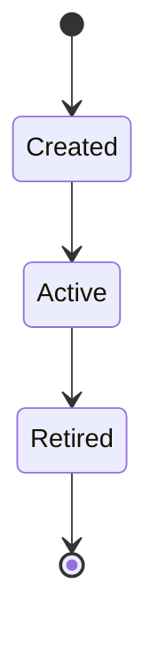
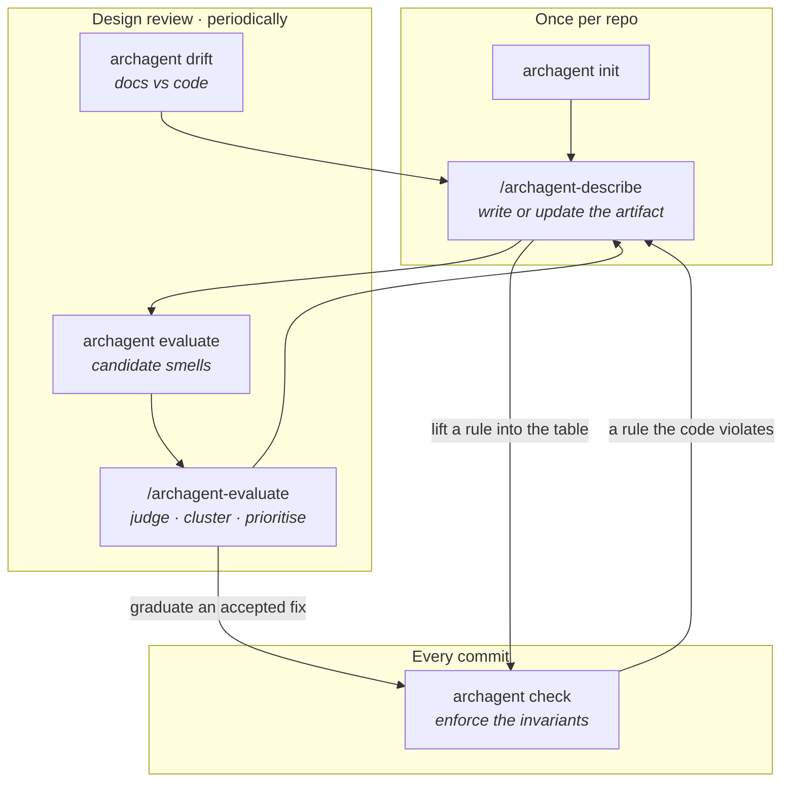

# archagent

Keep your codebase adherent to a described architecture — and teach your coding agent
to reason about it.

You describe the architecture as markdown in your repo (including a table of machine-checkable
**invariants**). archagent generates configs for existing tools (import-linter, dependency-cruiser,
ast-grep) from that single source and runs them, reporting adherence per invariant. The checkers
are deterministic; the LLM only ever *proposes*.

New to the project and want the reasoning rather than the usage? **[`docs/APPROACH.md`](docs/APPROACH.md)**
covers the principles, how the commands form one loop, how this relates to prior work, and what the
evaluations have and have not shown.

**It enforces the rules you already wrote down.** Design docs and code are full of stated invariants —
`# INVARIANT: the query set is always sorted`, "summaries must never be empty", "only the config layer
reads the environment" — that nothing checks. `archagent scan-invariants` finds them across your docs and
code, and the `describe` skill classifies each, verifies it against the code, and lifts it into the
enforceable table. Intent that was buried in prose becomes a checked rule — and a stated rule the code
*violates* is surfaced as drift (a real bug, or a stale design).

## Quickstart

Five minutes, in a repo you already have. You need [uv](https://docs.astral.sh/uv/) and a coding agent
(Claude Code, Cursor, Codex or OpenHands).

**1. Install the tool and scaffold the repo.**

```bash
uv tool install archagent==1.0.0rc1   # a release candidate: name the version, or you get 0.3.0
cd your-repo
archagent init .
```

`init` detects your languages and your coding agent, asks where the architecture docs should live, and
writes `archagent.toml` plus an empty `architecture/` scaffold. **It then prints every setting it wrote,
says whether each was detected, guessed or defaulted, and flags any that look wrong** — a source path
holding no matching files, or a `root_package` it could not find. Fix anything flagged before you go on:
a path that matches nothing scopes every rule to nothing, and `check` will then report that all
invariants hold having examined none of them.

**2. See what is already there.**

```bash
archagent scan-invariants     # rules your docs and code already state, but nothing checks
archagent status              # how big the repo is, and how much of it is described (nothing, yet)
```

**3. Let your agent describe the architecture.** In your coding-agent session:

```
/archagent-describe
```

It reads your README, design docs and code, verifies what it finds against the source, and writes the
constitution, one document per subsystem, and a first set of invariants — including the ones step 2
surfaced. This is the long step; on a mid-sized repo expect it to work for a while. When it finishes,
read `architecture/README.md`.

**4. Check the code against those invariants.**

```bash
archagent check
```

Each invariant reports PASS, WARN, FAIL or **skipped**. An invariant whose checker could not run is never
counted as passing.

**5. Make it stick.**

```bash
archagent install-hook        # run `check` on every commit
```

From here on: `archagent drift` tells you where the docs and the code have diverged, `archagent evaluate`
judges the architecture itself for system-level smells, and re-running `/archagent-describe` updates the
artifact. See [Workflow](#workflow) for when to reach for each.

## What it supports

**Languages.** archagent parses two, and this is the honest limit — if your codebase is mostly C++, Rust
or Java, the structural half of the tool has nothing to work with:

| | BOUNDARY (layering) | STRUCTURAL (code shape) | PBT (behavioural) | parsed by |
|---|---|---|---|---|
| **Python** | import-linter | ast-grep | Hypothesis | `ast` |
| **JavaScript / TypeScript** | dependency-cruiser | ast-grep | fast-check | regex |
| **anything else** | — | — | — | — |

Two things still work on an unparsed language. The **artifact** is prose and diagrams, so an agent can
describe a Go or Rust system perfectly well. And `evaluate`'s dependency graph falls back to the
`**Connects:**` edges your documents declare, so the structural signals still run — reported at lower
confidence, and labelled as resting on declarations nothing corroborated. What you lose is enforcement:
`check` has no checker to compile your invariants into.

**Coding agents.** The skills are one neutral source installed per agent:

| Agent | Installed into | Detected by `init`? |
|---|---|---|
| Claude Code | `.claude/skills/` | yes |
| Cursor | `.cursor/skills/` | yes |
| OpenHands | `.openhands/microagents/` | yes |
| Codex | `.agents/skills/` | **no — opt in with `--agents codex`** |

Codex keeps no per-repo directory, so nothing in your checkout says it is in use; it is fully supported
and simply cannot be auto-detected. It also reads a root `AGENTS.md` from the repo down, so `archagent
init --wire` alone gives it a working integration even with no skills installed.

Everything else — `drift`, `evaluate`, `status`, `graph`, `lint-docs` — is language-agnostic to the
degree its evidence allows, and each says in its own output when it could not see something.

## Install

archagent installs once (from outside your repos) and scaffolds into each project (like Spec-Kit).
Install it from PyPI:

```bash
uv tool install archagent==1.0.0rc1     # gives you an `archagent` command
# or run without installing:
uvx archagent==1.0.0rc1 init .
```

**Name the version.** The current release is a **release candidate**, and installers skip pre-releases
unless asked for one exactly — a plain `uv tool install archagent` silently gives you 0.3.0, which is old
enough to disagree with this page about what the artifact's index file is called. Once 1.0.0 is out the
bare name will be correct and this note goes away.

Prefer the latest unreleased code? Install from the repo instead:

```bash
uv tool install git+https://github.com/BenedatLLC/archagent
```

`archagent --version` prints what you have. Worth quoting in any bug report: what a command reports
depends on which build produced it.

## Upgrading

The prompts (agent skills + `architecture/AGENTS.md`) ship inside the archagent package, so upgrading is
**two steps**: update the tool, then refresh the repo.

1. **Update the archagent tool:**
   ```bash
   uv tool upgrade archagent                                   # installed from PyPI or GitHub
   # or, from a local checkout:
   git -C /path/to/archagent pull && uv tool install --force /path/to/archagent
   ```
2. **Refresh the repo's prompts:**
   ```bash
   cd your-repo
   archagent upgrade      # refreshes the skills + architecture/AGENTS.md only; leaves your
                          # archagent.toml and architecture content untouched (--agents to pick which)
   ```
3. **Restart your coding-agent session** so it reloads the updated skills (`/skills` in Claude Code to confirm).

> `archagent upgrade` alone won't help if the installed tool is stale — the prompts come from the package,
> so do step 1 first. Don't use `archagent init --force` to upgrade: it re-scaffolds everything and would
> overwrite your `invariants.md` and other authored content.

## The architecture artifact

`init` scaffolds an `architecture/` directory in your repo — plain markdown, versioned in git, the
shared source of truth that both humans and agents read and write:

| File | Tier | What it holds |
|------|------|---------------|
| `constitution.md` | hot (always loaded) | terse conventions + the handful of patterns the system relies on, and how to work here |
| `invariants.md` | hot | the **single source of truth** for checkable rules (the table archagent parses) |
| `subsystems/<name>.md` | cold (on demand) | one doc per subsystem, the narrative architecture across the six dimensions |
| `decisions/NNNN-*.md` | cold | ADRs — the *why* behind decisions, and the rejected alternatives ([where they come from](#where-adrs-come-from)) |
| `investigations/*.md` | cold | what an `evaluate` finding turned out to mean once someone read the code, with a minor/moderate/critical rating |
| `README.md` | hot | the entry document: what the system is, what to read first, the generated system map (forges render it when a reader opens the directory) |
| `log.md` | — | append-only, chronological change log (grep/tail friendly) |
| `deployment.md` | cold | deployment view (services/runtimes/infra) + configuration (the `**Config:**` env-key manifest) |
| `AGENTS.md` | — | how to work with archagent in this repo (archagent-owned; refreshed by `upgrade`) |

Two tiers, on purpose: the **hot** files are loaded into the agent every session, so they stay terse.
The **cold** files (subsystem docs, ADRs) are retrieved only when relevant, so they can be full
narrative — written so a new engineer can learn a subsystem by reading one doc, without chasing links.

The format is specified in full in [`docs/ADL-SPEC.md`](docs/ADL-SPEC.md).

### Where ADRs come from

Three sources, and it is worth knowing which because they arrive at different times:

1. **Ones you already have.** `describe` looks for existing design docs, RFCs, specs and ADR directories
   before it reads any code, and carries the decisions it finds into `decisions/` — verifying each against
   the code first, and flagging where the two disagree rather than quietly siding with the document.
2. **Ones it writes to explain a structure it found.** When a subsystem's shape has a reason that is not
   obvious from the code, that reason belongs in an ADR and the invariant enforcing it links there. This
   is why the `Why` column of the invariants table is a link: a rule with no rationale is one nobody can
   safely delete.
3. **Ones you write when you accept a finding.** An `evaluate` smell is a design decision — change the
   structure, or accept it and record why. Accepting without an ADR is how a deliberate trade-off becomes
   indistinguishable from an oversight six months later.

archagent's own [ADR 0003](docs/architecture/decisions/0003-drift-holds-shared-git-plumbing.md) is the
third kind: `evaluate` reports a dependency cycle in this codebase, and the ADR records it as a known cost
with a planned remedy rather than suppressing the finding.

### See a real one: [`docs/architecture/`](docs/architecture/)

**archagent describes itself.** That directory is not a sample — it is this repository's own artifact,
generated by `/archagent-describe`, and gated in CI by `archagent check`, `archagent drift
--exit-code` and `archagent lint-docs --exit-code` on every push — the same integration this
README recommends to you. It is also scored by the evaluation harness. Reading it is the fastest way to see what the output actually looks like:

- [`README.md`](docs/architecture/README.md) — the entry narrative and a generated Mermaid system map
- [`constitution.md`](docs/architecture/constitution.md) — the layering rules, in the terse always-loaded form
- [`invariants.md`](docs/architecture/invariants.md) — the enforced rules, each verified by planting a
  violation and watching `check` fail
- [`subsystems/drift.md`](docs/architecture/subsystems/drift.md) — a cold subsystem doc, with the diagram
  and the caption saying what to notice
- [`decisions/`](docs/architecture/decisions/) — ADRs, including one recording a dependency cycle
  the tool found in itself and has not yet fixed

That last point is the honest part: `evaluate` reports a `drift ↔ extraction` cycle in this codebase, and
[ADR 0003](docs/architecture/decisions/0003-drift-holds-shared-git-plumbing.md) records it as a known cost
rather than suppressing the finding.

## How architecture is modeled

Each subsystem is described across **six dimensions** (in `subsystems/<name>.md`):

1. **Process topology & components** — what the pieces are, how they connect, the entry points.
2. **Key abstractions & patterns** — the few patterns the system leans on, each with a concrete example.
3. **State & tiering** — what state exists and *where* it lives: in-memory, durable files, a database,
   a cache, a vector store. The storage tiers are made explicit.
4. **Lifecycles** — how components and state move through their states over time, as a **Mermaid
   `stateDiagram`** with a plain-language caption. State machines live here.
5. **Key flows** — the important end-to-end paths, as a **Mermaid `sequenceDiagram`** with a caption.
6. **System-wide invariants** — what must always hold; the checkable ones are linked to `invariants.md`.

Diagrams are text (Mermaid), so they diff cleanly and an agent can read and edit them. The *why*
behind any non-obvious choice goes in an ADR under `decisions/`, which invariants link to.


_A lifecycle is a state machine + a one-line caption: what it shows and the key takeaway._

**System-level view.** The six dimensions describe each subsystem in isolation; the *cross-cutting* view —
how the system is deployed and configured — lives in `deployment.md`:

- **Deployment topology** — the services / runtimes / infra the system runs as (read from
  `docker-compose` / k8s / `Procfile`), listed under a `**Services:**` manifest.
- **Configuration** — the environment keys the system reads, declared under a `**Config:**` manifest (or a
  committed `.env.example`). This is where configuration is modeled: `drift` compares the keys actually
  read in code against what's declared, and a config-access boundary can be enforced as an invariant
  (e.g. only a `config` module may read the environment).

These tie back to the subsystems through a few optional metadata fields on each `subsystems/<name>.md`:
`**Covers:**` (the code it owns), `**Service:**` (which deployment service it runs as), `**Tier:**` (its
layer), and `**Connects:** … via <kind>` (its dependencies, typed by connector — `import` / `sync-call` /
`async-event` / `shared-data` / `pipe`). `drift` and `evaluate` read these to check topology, layering,
data ownership, and deployment coupling. Every one of these fields is optional; the artifact is valid
without them and each one you add turns on another check. The full field syntax is in
[ADL-SPEC §4.2](docs/ADL-SPEC.md).

## Invariants are a markdown table

`architecture/invariants.md` — the first table is parsed; the prose around it is for humans:

| ID | Type | Tier | Applies-to | Rule | Severity | Why | Status |
|----|------|------|-----------|------|----------|-----|--------|
| BND-001 | BOUNDARY | structural | python | `forbid app.domain -> app.web` | error | [0007](decisions/0007-hexagonal.md) | active |
| BND-010 | BOUNDARY | structural | ts | `forbid src/domain -> src/ui` | error | [0008](decisions/0008-layers.md) | active |
| STR-002 | STRUCTURAL | structural | python | `forbid-pattern print($$$)` | warn | [0009](decisions/0009-no-io.md) | active |

- **Type** (the dimension it protects): BOUNDARY · INTERFACE · DATAFLOW · STRUCTURAL · PURPOSE.
- **Tier** (how it's enforced, cheapest first): structural · contract · pbt · model-check · **prose**.
- **Rule** (compact DSL):
  - `forbid <a> -> <b>[, <c>...]` — BOUNDARY (must not import *directly*).
  - `forbid-pattern <ast-grep pattern> [in|outside <scope>]` — STRUCTURAL (a code shape that must not
    appear). `in <scope>` flags matches only there; `outside <scope>` flags everywhere *except* there
    (the "only `<scope>` may do this" case). `<scope>` is a path/glob (`src/app/domain`) or a dotted
    module (`app.domain.workflow`); omit it to scan all sources.
  - `property <path::test>` — a **behavioral / data invariant** ("all state is per-user", round-trip
    properties) checked by a **property-based test**. The target's file extension picks the framework:
    `.py` → a Hypothesis `@given` stub, a JS/TS file → a **fast-check** `fc.property` stub. `check` runs it
    in the *project's* env (`[python] test_command` / `[ts] test_command`) and reports the counterexample.
  - `property stateful <path::TestCase>` — for **stateful** systems (state machines, stores, lifecycles):
    a Hypothesis `RuleBasedStateMachine` (Python) or a fast-check `fc.commands` model-based stub (JS/TS) —
    random operation sequences checked against invariants, the right tool for state/data-layer bugs.
- **Severity**: `error` fails `check`; `warn` is reported but doesn't fail.
- **Why**: a link to the ADR with the rationale.

**Record every rule as a row, including the ones nothing can check yet.** Give those **Tier `prose`**:
they live in the table but are never generated or run, so they stay documented, greppable, and ready to
graduate. Two optional columns exist for exactly these rows — **`Verification`** (the test, command or
audit that confirms it, where `none` is a legitimate and more useful answer than a blank) and
**`Graduation path`** (what would make it mechanical, or that nothing would). Without them, "archagent
cannot generate a checker for this" and "nobody checks this" look identical in the table.

A walkthrough — what each type and tier actually enforces, how to verify a new rule catches
something, and how to wire this into commits and CI — is in
[`docs/CHECKING.md`](docs/CHECKING.md). The normative reference is [ADL-SPEC §6](docs/ADL-SPEC.md).

## How it works

```
architecture/invariants.md  ──gen──▶  checker configs  ──check──▶  per-invariant report
      (single source)            (existing tools = the diff)        (PASS / WARN / FAIL)
```

archagent doesn't reimplement architecture checking — it compiles your invariant table into configs for
tools that already do it, and maps their results back to invariant IDs. The capability matrix picks the
tool per `(invariant tier × language)`:

| Tier / invariant | Python | JS / TS |
|------------------|--------|---------|
| BOUNDARY / layering | import-linter | dependency-cruiser |
| STRUCTURAL (code shape) | ast-grep | ast-grep |
| PBT (behavioral / data) | Hypothesis | fast-check |

Adding a language is adding a column, not rewriting anything. Generated configs live under
`.archagent/generated/` and are gitignored — they're derived from the table and regenerated on every
`check`.

The one other file archagent writes is `.archagent/history-profile.json`: how *this* repo words its bug-fix
commits, learned from your commit guidelines and a sample of real subjects (`archagent history-profile
--write`). Unlike the generated configs, **commit it** — it's small, it makes the history-based `evaluate`
signals reproducible across machines and CI, and it's the file to hand-edit when the inferred recognizer
misreads your convention.

## Workflow



_Two loops at two speeds. The **inner** one is `check`, on every commit, and it is the only gate — it
exits nonzero and drops into a hook or CI unchanged. The **outer** one runs at design review and
periodically: `drift` says where the documents stopped matching the code, `evaluate` proposes what might
be wrong with the design itself, and `describe` is what reconciles both back into the artifact. Nothing
in the outer loop blocks a commit; its output is a work-list._

**Set up the architecture (once per repo)** — this is the [Quickstart](#quickstart) above:
`archagent init .`, then `/archagent-describe` in your coding agent, then `archagent check`.

**Keep it honest as you work:**

- **Every commit** — `archagent install-hook` runs `check` on each commit (`--skip-pbt` for the fast
  static tiers only). `check` exits nonzero on an error-severity violation, so it drops straight into CI.
- **Add an invariant** — **`/archagent-invariant`**, or edit `architecture/invariants.md` by hand, to
  encode a new rule (from a design decision, or lifted from a subsystem doc); `check` confirms it catches
  the right thing.
- **Mine stated invariants** — `archagent scan-invariants` surfaces rules already written in your docs and
  code; the `describe` skill classifies each, verifies it, and lifts the checkable ones into the table
  (capturing the rest as cited prose rows).
- **See what drifted** — `archagent drift` diffs the docs against the code: dangling references, stale
  docs, undocumented modules, undeclared subsystem dependencies, entry points, the web-route surface,
  configuration keys, deployment topology, and connector-kind mismatches. Informational; its output
  (`--json` for tooling) is the update work-list.
- **Evaluate the architecture** — `archagent evaluate` (or **`/archagent-evaluate`**) judges the *model
  itself* for system-level smells: source-of-truth and data-ownership problems, God Components, dependency
  cycles, leaky abstractions, distributed-monolith shapes, observability and exposure gaps, and
  git-history signals like shotgun surgery and change-prone complex files. It emits *candidate* signals;
  the skill judges them in context, clusters to roots, and prioritizes. Advisory, not a commit gate.
- **Update the architecture** (a new design, or the code changed) — re-run **`/archagent-describe`**:
  it's *build-**or-update***. Start from `archagent drift` (reconcile doc-vs-code), then `archagent evaluate`
  (assess system-level health); refresh the subsystem(s) that changed and reconcile the invariants. Drift
  items are record fixes; evaluate findings are design decisions — change the structure or accept it with an
  ADR, and graduate the fixes you want to hold into `check` invariants.
- **Upgrade the prompts** — update the tool, then `archagent upgrade`. See [Upgrading](#upgrading).

**Where the output goes.** `drift` and `evaluate` **write nothing** — they print a report, or JSON with
`--json`, and that is the whole of it. Findings live only in your terminal until something records them,
which is deliberate: a signal is a candidate, and a candidate written into the artifact before anyone
judged it is a claim nobody made. Two commands do write: `archagent investigate <id> --record <file.md>`
stores a verdict under `<arch-dir>/investigations/` so a settled finding stops asking, and
`/archagent-evaluate` turns accepted findings into ADRs and invariant rows through `describe`. `check`
writes only the derived configs under `.archagent/generated/`.

> Cadence: `describe` + `evaluate` at design-review time and periodically; `check` on every commit.
> archagent enforces *your system's* design rules and flags *system-level* smells (candidates its skill
> judges in context) — it isn't a generic metrics dashboard.

In Claude Code, invoke a skill directly as `/archagent-describe` (etc.) or just describe the task and
Claude activates it. Skills are installed per agent — Claude Code `.claude/skills/`, Cursor
`.cursor/skills/`, Codex `.agents/skills/`, OpenHands `.openhands/microagents/` — plus
`architecture/AGENTS.md`, the full instructions, which archagent owns.

## Commands

Full reference with every option: **[`docs/COMMANDS.md`](docs/COMMANDS.md)**.

| Command | What it does |
|---------|--------------|
| `archagent help` | overview of the lifecycle and the command/skill for each step |
| `archagent init [PATH]` | scaffold `archagent.toml` + the architecture templates + agent skills |
| `archagent upgrade` | refresh the archagent-owned prompts to match the installed tool |
| `archagent check` | run the checkers, report per invariant (exit 1 on an error-severity failure) |
| `archagent gen` | regenerate only the checker configs (`check` does this for you) |
| `archagent install-hook` | install a git pre-commit hook that runs `check` |
| `archagent drift` | diff the architecture docs against the code — informational |
| `archagent evaluate` | judge the architecture for system-level smells — advisory |
| `archagent investigate <id>` | turn one `evaluate` finding into a verdict, and record it |
| `archagent status` | coverage, depth, and how much of the code the docs actually name |
| `archagent graph` | generate the Mermaid system map from the docs' metadata |
| `archagent lint-docs` | lint Mermaid syntax and invariant-ID citations in the docs |
| `archagent scan-invariants` | find rules the docs and code already state but nothing checks |
| `archagent history-profile` | learn how this repo words its bug-fix commits |
| `archagent modules` | diagnostic: module resolution and top-level name collisions |

Every command takes `--project PATH` (default `.`). `archagent --version` prints the installed version.

Agent skills: `/archagent-describe` · `/archagent-check` · `/archagent-invariant` ·
`/archagent-evaluate` · `/archagent-help`.

## Configuration

`archagent init` writes `archagent.toml` and prints every value it chose, marking each detected, guessed
or defaulted, and flagging any that look wrong. That output is the fastest way to check it.

The one to get right is `[python] root_package`: if it names nothing, every BOUNDARY contract scopes to an
empty module set and `check` reports that all invariants hold having examined nothing. `archagent modules`
diagnoses it in one command.

Full reference — every key, the `source_paths` rule people get wrong, and worked examples for the three
common layouts: **[`docs/CONFIGURATION.md`](docs/CONFIGURATION.md)**.

## What to read next

| If you want | Read |
|---|---|
| **why the project works this way, and how it relates to prior work** | **[`docs/APPROACH.md`](docs/APPROACH.md)** |
| to enforce rules: invariant types, the DSL, hooks and CI | [`docs/CHECKING.md`](docs/CHECKING.md) |
| every command and option in full | [`docs/COMMANDS.md`](docs/COMMANDS.md) |
| to configure `archagent.toml` for your layout | [`docs/CONFIGURATION.md`](docs/CONFIGURATION.md) |
| the artifact format, as a spec — fields, tiers, the rule DSL | [`docs/ADL-SPEC.md`](docs/ADL-SPEC.md) |
| a real artifact, not a sample | [`docs/architecture/`](docs/architecture/) — this repo describes itself |
| what the evaluation runs concluded, and how much to trust it | [`docs/evaluations/README.md`](docs/evaluations/README.md) |
| what is planned, and in what order | [`docs/ROADMAP.md`](docs/ROADMAP.md) |
| how a release is cut | [`docs/RELEASING.md`](docs/RELEASING.md) |

The evaluations are worth a look before you rely on a signal. Several are measured against blind human
labelling and the numbers are on the page, including the ones that came back badly.

## Repository layout

The layout of this source repository (distinct from the `architecture/` artifact archagent *generates* in
a target repo, described above):

```
archagent/
├── README.md                 this file
├── pyproject.toml            package metadata + dependencies (uv)
├── docs/
│   ├── architecture/         archagent's own artifact — it describes itself (archagent.toml points here)
│   ├── designs/              one design doc per feature, with `status:` frontmatter
│   ├── evaluations/          what the evaluation runs concluded (the data lives in a separate repo)
│   ├── APPROACH.md           the thinking: principles, the loop, prior work, what we measured
│   ├── CHECKING.md           guide: enforcing invariants (types, DSL, hooks, CI)
│   ├── COMMANDS.md           the full CLI reference
│   ├── CONFIGURATION.md      archagent.toml: every key, and the layouts people get wrong
│   ├── ROADMAP.md            planned future work, grouped by theme (checkable)
│   ├── ADL-SPEC.md           the architecture-artifact format, as a standards-style spec
│   └── RELEASING.md          how to cut a new release to PyPI
├── src/archagent/
│   ├── cli.py                the `archagent` CLI (init · gen · check · drift · evaluate · status · graph …)
│   ├── config.py             archagent.toml loading (languages, source paths, test commands)
│   ├── invariants.py         parse the invariants.md table  ·  rules.py — the Rule DSL
│   ├── generate.py           compile invariants → checker configs  ·  check.py — run them, map results
│   ├── init.py               scaffold the artifact + per-agent skills; upgrade prompts
│   ├── drift.py              the reflexion-diff (docs vs code): the `drift` + `modules` commands
│   ├── evaluate.py           system-level architecture smells: the `evaluate` command
│   ├── history.py            learn this repo's bug-fix commit wording: the `history-profile` command
│   ├── hotspots.py           churn × indentation-complexity: the change-prone-file check
│   ├── dupdecide.py          duplicated branch-value sets: the scattered-source-of-truth check
│   ├── investigations.py     recorded verdicts on findings, stored in the artifact
│   ├── status.py             per-package coverage snapshot: the `status` command
│   ├── described.py          which assigned modules a document actually names
│   ├── graph.py              Mermaid system map from metadata: the `graph` command
│   ├── docscan.py            doc linter (Mermaid syntax, invariant IDs): the `lint-docs` command
│   ├── <extraction scanners> configscan · deployscan · webapi · datamap · cochange · connscan · obsscan
│   │                         (static, no-execution extractors: env keys, IaC, routes, datastores,
│   │                          git co-change + per-file churn, connector kinds, observability)
│   └── templates/
│       ├── architecture/     the artifact scaffold (constitution, invariants, subsystems, deployment…)
│       └── agent/phases/     the neutral skill prompts (describe · check · invariant · evaluate)
├── examples/                 sample_py, sample_ts — end-to-end fixtures
├── scripts/                  evaluation CLIs: selfeval · defect_study · spotcheck · blindcomp · ledger
│                             (evalhome.py resolves where their output goes)
├── tests/                    the pytest suite, and the evaluation harness it exercises
│   ├── rubric.py             the deterministic half of the artifact rubric
│   ├── rubric_judged.py      the judged half: anchored criteria, resolved citations
│   ├── ledger.py             one row per evaluation run; refuses to compare incomparable rows
│   ├── findings.py           capture `evaluate` output per run, and the checks needing no judge
│   ├── defect_study.py       rate ratios, bootstrap intervals, churn-decile stratification
│   ├── corpus.py             pinned-repo regression  ·  spotcheck.py · blindcomp.py
│   ├── golden/               projected `evaluate` output for the built-in fixture repos
│   └── corpus/               … and for real repositories pinned to a tag (`pytest -m corpus`)
└── .github/workflows/ci.yml  CI (runs the suite on every push/PR)
```

**The evaluation harness ships in `tests/`, not in the package.** Nothing under `scripts/` or the harness
modules is installed by `pip install archagent`; they exist to measure the tool, not to run it. The data
those runs produce lives in a separate private repository — see
[`docs/evaluations/README.md`](docs/evaluations/README.md) for what was concluded and where the evidence
sits.

## Development

```bash
uv sync --group dev
uv run pytest            # unit tests (DSL + table parsing, config generation, init/upgrade logic)
                         # + an end-to-end check on examples/sample_py (real import-linter + ast-grep)
```

Two end-to-end fixtures come with the repo, which is the quickest way to see a real `check` run without
scaffolding anything:

```bash
uv run archagent check --project examples/sample_py    # Python — real import-linter + ast-grep
uv run archagent check --project examples/sample_ts    # TS — dependency-cruiser + ast-grep (needs Node)
```

Tests run in CI on every push/PR (`.github/workflows/ci.yml`), which also runs `archagent check`,
`archagent drift --exit-code` and `archagent lint-docs --exit-code` against this repository's own
artifact. The TS/PBT paths need Node and a target test environment, so they're validated via the examples
above rather than in the unit suite.
