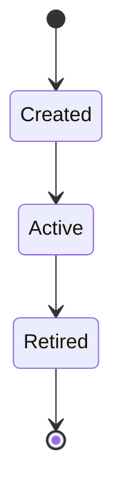

# archagent

Keep your codebase adherent to a described architecture — and teach your coding agent
to reason about it.

You describe the architecture as markdown in your repo (including a table of machine-checkable
**invariants**). archagent generates configs for existing tools (import-linter, dependency-cruiser,
ast-grep) from that single source and runs them, reporting adherence per invariant. The checkers
are deterministic; the LLM only ever *proposes*.

> Status: early. v1 covers BOUNDARY invariants (Python via import-linter, JS/TS via dependency-cruiser),
> STRUCTURAL invariants (any language via ast-grep, path-scopable), and a PBT tier for behavioral/data
> invariants (Python via Hypothesis) — all driven by `architecture/invariants.md`, plus per-agent
> delivery for Claude Code, Cursor, and OpenHands.

## Quickstart

archagent installs from outside your repo and scaffolds into it (like Spec-Kit):

```bash
uvx archagent init .        # scaffold archagent.toml + architecture/ + agent skills
# ...describe your architecture and add invariants (see below)...
uvx archagent check         # run the checkers, report per invariant (exit 1 on an error-severity failure)
```

`init` detects your languages, writes a starter `archagent.toml`, lays down the `architecture/`
templates, and installs the phase skills into each agent you select
(`--agents claude,cursor,openhands`, or `--agents none`).

## The architecture artifact

`init` scaffolds an `architecture/` directory in your repo — plain markdown, versioned in git, the
shared source of truth that both humans and agents read and write:

| File | Tier | What it holds |
|------|------|---------------|
| `constitution.md` | hot (always loaded) | terse conventions + the handful of patterns the system relies on, and how to work here |
| `invariants.md` | hot | the **single source of truth** for checkable rules (the table archagent parses) |
| `subsystems/<name>.md` | cold (on demand) | one doc per subsystem, the narrative architecture across the six dimensions |
| `decisions/NNNN-*.md` | cold | ADRs — the *why* behind decisions, and the rejected alternatives |
| `index.md` | hot | catalog of the docs |
| `log.md` | — | append-only, chronological change log (grep/tail friendly) |

Two tiers, on purpose: the **hot** files are loaded into the agent every session, so they stay terse.
The **cold** files (subsystem docs, ADRs) are retrieved only when relevant, so they can be full
narrative — written so a new engineer can learn a subsystem by reading one doc, without chasing links.

## How architecture is modeled

Each subsystem is described across **six dimensions** (in `subsystems/<name>.md`):

1. **Process topology & components** — what the pieces are, how they connect, the entry points.
2. **Key abstractions & patterns** — the few patterns the system leans on, each with a concrete example.
3. **State & tiering** — what state exists and *where* it lives: in-memory, durable files, a database,
   a cache, a vector store. The storage tiers are made explicit.
4. **Lifecycles** — how components and state move through their states over time, as a **Mermaid
   `stateDiagram`** with a plain-language caption. State machines live here.
5. **Key flows** — the important end-to-end paths, as a **Mermaid `sequenceDiagram`** with a caption.
6. **System-wide invariants** — what must always hold; the checkable ones are linked to `invariants.md`.

Diagrams are text (Mermaid), so they diff cleanly and an agent can read and edit them. The *why*
behind any non-obvious choice goes in an ADR under `decisions/`, which invariants link to.


_A lifecycle is a state machine + a one-line caption: what it shows and the key takeaway._

## Invariants are a markdown table

`architecture/invariants.md` — the first table is parsed; the prose around it is for humans:

| ID | Type | Tier | Applies-to | Rule | Severity | Why | Status |
|----|------|------|-----------|------|----------|-----|--------|
| BND-001 | BOUNDARY | structural | python | `forbid app.domain -> app.web` | error | [0007](decisions/0007-hexagonal.md) | active |
| BND-010 | BOUNDARY | structural | ts | `forbid src/domain -> src/ui` | error | [0008](decisions/0008-layers.md) | active |
| STR-002 | STRUCTURAL | structural | python | `forbid-pattern print($$$)` | warn | [0009](decisions/0009-no-io.md) | active |

- **Type** (the dimension it protects): BOUNDARY · INTERFACE · DATAFLOW · STRUCTURAL · PURPOSE.
- **Tier** (how it's enforced, cheapest first): structural · contract · pbt · model-check.
- **Rule** (compact DSL):
  - `forbid <a> -> <b>[, <c>...]` — BOUNDARY (must not import *directly*).
  - `forbid-pattern <ast-grep pattern> [in|outside <scope>]` — STRUCTURAL (a code shape that must not
    appear). `in <scope>` flags matches only there; `outside <scope>` flags everywhere *except* there
    (the "only `<scope>` may do this" case). `<scope>` is a path/glob (`src/app/domain`) or a dotted
    module (`app.domain.workflow`); omit it to scan all sources.
  - `property <path::test>` — a **behavioral / data invariant** ("all state is per-user", state-machine
    or round-trip properties) checked by a **property-based test**. `gen` scaffolds a Hypothesis stub
    (you fill in the property, since it needs system knowledge); `check` runs it in the *project's* env
    (`[python] test_command`, e.g. `uv run pytest`) and reports the minimal counterexample on failure.
- **Severity**: `error` fails `check`; `warn` is reported but doesn't fail.
- **Why**: a link to the ADR with the rationale.

## How it works

```
architecture/invariants.md  ──gen──▶  checker configs  ──check──▶  per-invariant report
      (single source)            (existing tools = the diff)        (PASS / WARN / FAIL)
```

archagent doesn't reimplement architecture checking — it compiles your invariant table into configs for
tools that already do it, and maps their results back to invariant IDs. The capability matrix picks the
tool per `(invariant tier × language)`:

| Tier / invariant | Python | JS / TS |
|------------------|--------|---------|
| BOUNDARY / layering | import-linter | dependency-cruiser |
| STRUCTURAL (code shape) | ast-grep | ast-grep |
| PBT (behavioral / data) | Hypothesis | fast-check *(planned)* |

Adding a language is adding a column, not rewriting anything. Generated configs live under
`.archagent/generated/` and are gitignored — they're derived from the table and regenerated on every
`check`.

## Agent workflow

`init` installs three phase skills into each selected agent (Claude Code `.claude/skills/`, Cursor
`.cursor/skills/`, OpenHands `.openhands/microagents/`) plus a shared `AGENTS.md`:

- **describe** — build or update the architecture artifact (read existing docs, but verify against the
  code; extract structure with ast-grep/grep; write the six-dimension docs and invariants).
- **check** — run `archagent check`; fix violations, or change the invariant and record an ADR.
- **invariant** — add or change a checkable rule and confirm it catches the right thing.

## Configuration

A small `archagent.toml` at the repo root tells archagent where the code is:

```toml
[project]
languages = ["python", "ts"]

[python]
root_package = "app"
source_paths = ["src"]

[ts]
source_paths = ["src"]
```

## Try it

```bash
uv run archagent check --project examples/sample_py    # Python (import-linter + ast-grep)
uv run archagent check --project examples/sample_ts    # TS (dependency-cruiser + ast-grep)
```

## What it composes

import-linter (Python boundaries) · dependency-cruiser (JS/TS boundaries) · ast-grep (structural,
any language) · grep/git for retrieval and history. archagent is the thin layer that turns one
markdown table into those tools' configs and reports results per invariant.
