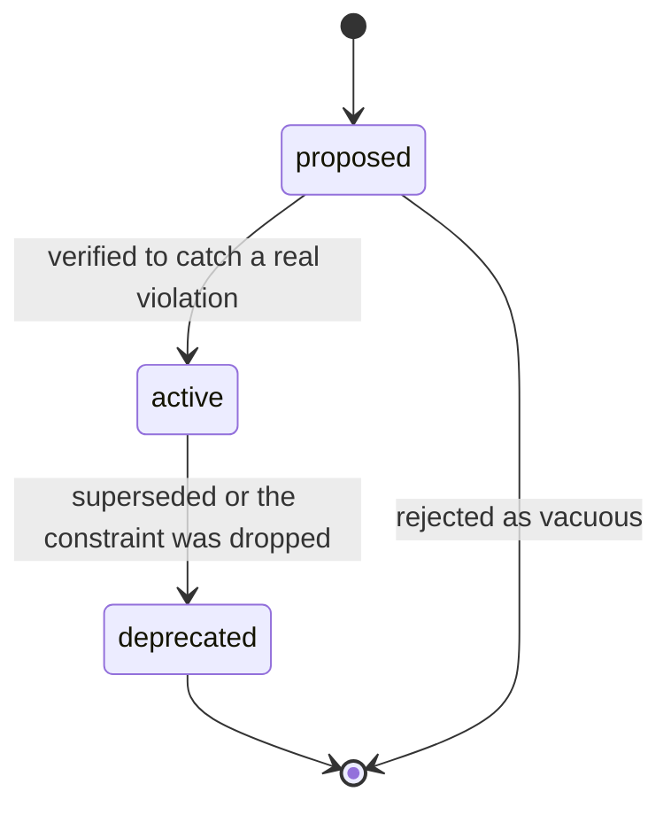
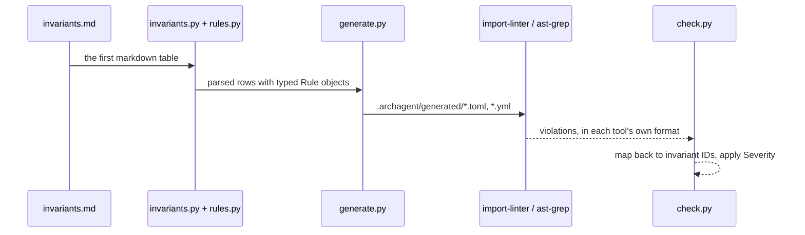

# invariant-pipeline — from a markdown table to a pass/fail report

**Covers:** `src/archagent/invariants.py`, `src/archagent/rules.py`, `src/archagent/generate.py`, `src/archagent/check.py`
**Tier:** domain
**Connects:** config via import

## Purpose

The enforcement half of the tool. A team writes rules in one markdown table; this subsystem compiles them
into configuration for checkers that already exist, runs those checkers, and maps their output back to the
rule that failed.

## Topology and components

A four-stage pipeline, one module per stage:

| Module | Job |
|---|---|
| `invariants.py` | parse the first markdown table in `invariants.md` into rows |
| `rules.py` | parse the `Rule` cell's compact DSL (`forbid a -> b`, `forbid-pattern 
 [in\|outside <scope>]`) |
| `generate.py` | emit `.archagent/generated/` configs for import-linter, dependency-cruiser, ast-grep |
| `check.py` | run each checker, map results back to invariant IDs, decide pass/warn/fail |

## Key abstractions

**Compile, do not reimplement.** archagent never analyses imports itself; it writes an import-linter
contract and reads the result (`generate.py`). Adding a language is adding a column to the capability
matrix, not writing an analyser.

**The table is the single source of truth.** Generated configs are derived and gitignored, regenerated on
every `check`. Editing one by hand is pointless by construction — which is the property the tool's own
scattered-source-of-truth check exists to protect elsewhere.

## State and tiering

`invariants.md` in the artifact (durable, authored). `.archagent/generated/` (derived, disposable).

## Lifecycles

_An invariant's `Status` column. The transition that matters is `proposed -> active`: a rule is only
promoted once a `check` run shows it fails on a real violation, which is what keeps vacuous rules —
those that cannot fail — out of the table._

## Key flows

_One table becomes several tools' configs and their output is folded back to per-invariant results. The
mapping step is why a failure names `BND-001` rather than an import-linter contract number._

## Invariants

Rules in this repo's own table are enforced by this subsystem — it checks itself.
