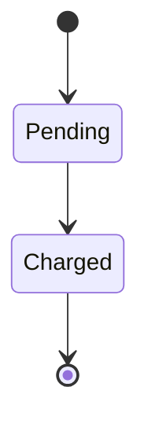

# archagent Architecture Description Language — Specification

**Status:** Draft
**Version:** 0.1
**Date:** 2026-07-23
**Editors:** the archagent project

## Abstract

This document specifies the **archagent Architecture Description Language** (hereafter "the ADL"): a
lightweight, text-based notation for describing a software system's architecture and its checkable design
rules. The ADL is expressed as a directory of Markdown documents with a small set of structured metadata
fields, Mermaid diagrams, and one canonical invariants table. It is designed to be read and written by
both human engineers and AI coding agents, versioned in Git, and consumed by static tools (`drift`,
`evaluate`, `check`) without executing the described system.

In the terms of Medvidovic & Taylor's ADL classification framework, this is an **informal, explicit-
configuration ADL**: components (subsystems/services), connectors (typed edges), and configurations
(topology, deployment, invariants) are all first-class, but the notation is prose-and-table rather than a
formal calculus.

## Status of This Document

This is a working specification of the format currently implemented by archagent. It is expected to
evolve; unimplemented or reserved constructs are marked as such. Where this document and the archagent
implementation disagree, the implementation is authoritative and the discrepancy SHOULD be reported.

## 1. Introduction

### 1.1 Purpose

An architecture artifact conforming to this specification serves as the shared source of truth that (a) a
human or agent reads to understand the system, (b) tools diff against the code to detect drift, and (c)
tools compile into enforcement configurations. The format is optimized for low-friction authorship,
clean textual diffs, and gated (low-noise) machine extraction.

### 1.2 Design Principles

- **Human- and agent-readable.** Plain Markdown; no bespoke file format.
- **Additive and gated.** Every structured field is OPTIONAL. A signal that depends on a field is emitted
  only when that field is present.
- **Static and non-executing.** All extraction is by text/AST analysis; the described system is never run.
- **Intended-model, else inferred.** Declared metadata is authoritative; tools MAY infer the same facts
  from code and MUST treat a declaration as ground truth when both exist.

### 1.3 Requirements Language

The key words **MUST**, **MUST NOT**, **REQUIRED**, **SHALL**, **SHOULD**, **SHOULD NOT**, **MAY**, and
**OPTIONAL** in this document are to be interpreted as described in RFC 2119.

## 2. Terminology

- **Artifact** — the `architecture/` directory as a whole.
- **Subsystem** — a named unit of the system, described by one document under `subsystems/`. The document's
  file stem (filename without `.md`) is the subsystem's **name** and its identifier in cross-references.
- **Service** — a deployable runtime unit (a process/container). A subsystem MAY be mapped to a service.
- **Connector** — a typed directed relationship between two subsystems (see §4.3).
- **Field** — a structured single-line key/value annotation (see §3.3).
- **Invariant** — a row in the invariants table (see §6) expressing a checkable design rule.

## 3. Document Model

### 3.1 Directory Layout

A conforming artifact is a single directory holding the members below. Its location defaults to
`architecture/` at the repository root but is configurable — recorded as `[project] architecture_dir` in
`archagent.toml` (e.g. `docs/architecture`) — and consumers MUST read that setting rather than assuming the
default. Members are referenced relative to the artifact directory, so the artifact moves as a unit. It MAY
contain the following members; a conforming producer SHOULD create them; a conforming consumer MUST tolerate
the absence of any of them.

```
architecture/
├── constitution.md            REQUIRED  always-loaded conventions and load-bearing patterns
├── invariants.md              REQUIRED  the canonical invariants table (§6)
├── index.md                   OPTIONAL  catalog of the documents
├── log.md                     OPTIONAL  append-only chronological change log
├── deployment.md              OPTIONAL  system-level view: services + configuration (§5)
├── AGENTS.md                  OPTIONAL  tool-owned usage instructions
├── subsystems/
│   └── <name>.md              zero or more subsystem documents (§4)
└── decisions/
    └── NNNN-<slug>.md         zero or more Architecture Decision Records (ADRs)
```

`index.md`, when present, MAY carry a **system map**: a single fenced Mermaid `flowchart` — one node per
subsystem, one edge per declared `Connects` relation (§4.3), typed by connector kind — delimited by the
HTML-comment markers `<!-- archagent:graph -->` and `<!-- /archagent:graph -->`. The map is derived
entirely from subsystem metadata, so a producer SHOULD regenerate it rather than hand-edit it (`archagent
graph --write` replaces the content between the markers idempotently). A consumer MUST treat everything
between the markers as generated and MAY overwrite it.

### 3.2 File Naming

- A subsystem document MUST reside directly under `subsystems/` and MUST have a `.md` extension. Its stem
  is its name.
- A file whose name ends in `_TEMPLATE.md` is a template and MUST be ignored by consumers.
- An ADR SHOULD be named `NNNN-<slug>.md` where `NNNN` is a zero-padded ordinal.

### 3.3 Field Syntax

A **field** is a single line associating a name with a value. A field line MUST match, case-insensitively:

```
field-line = *WSP "**" *WSP name *WSP [":"] *WSP "**" *WSP [colon] *WSP value
colon      = ":" / "："                   ; ASCII or fullwidth
value      = 1*VCHAR-to-end-of-line
```

The **canonical form** is:

```
**Name:** value
```

Normative constraints (see issue #1 for the failures these prevent):

- The bold `**` markers are **REQUIRED**. A line that merely *begins* with a field word (ordinary prose,
  a Mermaid node such as `Configured -->`) is not a declaration and MUST NOT be parsed as one.
- A field line MUST be interpreted only **outside fenced code blocks** (```` ``` ```` / `~~~`). Content
  inside a fence (Mermaid diagrams, code samples) MUST NOT be scanned for declarations.
- A value that is empty or a **placeholder** — `(none)`, `n/a`, `tbd`, or a parenthetical aside such as
  `_(none — base of the graph)_` — MUST be treated as **no declaration**. Producers MUST omit the field
  entirely rather than writing such a value; consumers MUST NOT tokenise it into items.

Backtick code spans around individual tokens in a value MUST be tolerated and stripped. Unless a field's
definition states otherwise (see §4.2 `Connects`), a value is a list split on commas and/or whitespace.

## 4. Subsystem Documents

### 4.1 Narrative Structure

A subsystem document SHOULD describe the subsystem across six **dimensions**, each as a Markdown section:

1. **Process topology & components** — the parts, how they connect, and entry points.
2. **Key abstractions & patterns** — the patterns the subsystem relies on, with concrete examples.
3. **State & tiering** — what state exists and where it lives (in-memory, durable, cache, database…).
4. **Lifecycles** — a Mermaid `stateDiagram` (§4.4) with a caption.
5. **Key flows** — a Mermaid `sequenceDiagram` (§4.4) with a caption.
6. **System-wide invariants** — which rules in `invariants.md` apply here and why.

Narrative structure is RECOMMENDED but not machine-validated. Claims SHOULD cite real file paths.

### 4.2 Metadata Fields

A subsystem document MAY declare the following fields (§3.3). All are OPTIONAL.

| Field | Cardinality | Value | Consumed by |
|-------|-------------|-------|-------------|
| `Covers` | list of globs | code the subsystem owns, e.g. `src/billing/**` | drift (staleness, ownership) |
| `Connects` | list (§4.3) | typed dependencies on other subsystems | drift, evaluate |
| `Depends-on` | list of names | **deprecated alias** for `Connects`, all of kind `import` | drift |
| `Service` | single name | the deployment service this subsystem runs as | drift, evaluate |
| `Tier` | single token | the architectural layer (§4.5) | evaluate |

Notes:

- `Covers` values are globs resolved against the repository root. They own **source-code files only**
  (`.py .ts .tsx .js .jsx .mjs .cjs .go .rs .java .rb`); a glob that matches non-code assets (data files,
  templates) is accepted but contributes no coverage — data files are described in prose, not Covered. A
  glob matching **no file at all** is a defect a consumer SHOULD report. In the absence of `Covers`, a
  consumer MAY fall back to **backtick file references** — inline code spans whose text ends in a
  recognized source extension.
- `Service` is distinguished from the plural `Services` (§5.1) and MUST NOT match it. If multiple tokens
  are given, the first is used.
- When both `Connects` and `Depends-on` appear, `Connects` takes precedence.

### 4.3 Connectors

The `Connects` field lists directed connectors from this subsystem to others. Its value is:

```
connects-value = connect-item *( "," connect-item )
connect-item   = target [ 1*WSP "via" 1*WSP kind ]
target         = subsystem-name
kind           = "import" / "sync-call" / "async-event" / "shared-data" / "pipe"
```

- If `via kind` is omitted, the kind defaults to `import`.
- An unrecognized kind MUST be treated as `import` (tolerant parsing keeps a typo low-noise).
- **Legacy form:** a `connect-item` without `via` MAY contain multiple whitespace-separated targets, each
  taken with kind `import`.

Connector kinds and their coupling semantics:

| Kind | Interaction | Coupling |
|------|-------------|----------|
| `import` | in-process code dependency | tight (compile-time) |
| `sync-call` | blocking request/response (HTTP, gRPC, RPC) | tight (caller blocks) |
| `async-event` | publish/subscribe, message queue | loose (decoupled lifecycles) |
| `shared-data` | both parties read/write a shared store | tight (data coupling) |
| `pipe` | one-way buffered stream | loose (directional) |

Consumers classify `import`, `sync-call`, and `shared-data` as **synchronous/tight** and `async-event`
and `pipe` as **asynchronous/loose**; this distinction drives, e.g., distributed-monolith detection.

### 4.4 Diagrams

Lifecycles and flows MUST be expressed as fenced Mermaid code blocks so they diff as text and are
agent-editable. A lifecycle SHOULD use `stateDiagram-v2`; a flow SHOULD use `sequenceDiagram`. Each
diagram SHOULD be immediately followed by a one-line plain-language caption.

Every Mermaid block MUST be syntactically valid — it MUST declare a recognized diagram type on its first
content line and MUST parse. In particular, a `stateDiagram`/`stateDiagram-v2` transition label (the text
after the first `:` in `A --> B : label`) MUST NOT contain a further `:`; Mermaid treats everything after
the first colon as the label, so a second colon (a port `:5300`, a time `10:30`, a ratio) breaks the parser.
Because these blocks are prose — not part of the invariants table — they are not exercised by `check`; a
conforming producer SHOULD validate them separately (`archagent lint-docs` does this deterministically,
without a renderer), since a malformed diagram otherwise surfaces only when a human renders it.

### 4.5 Tier Vocabulary

The `Tier` field's token is matched case-insensitively against the following layers, ordered from highest
(4) to lowest (1). Consumers use the ordering to detect layering violations (a lower tier depending upward,
or a dependency skipping a tier).

| Rank | Recognized tokens |
|------|-------------------|
| 4 (top) | `ui`, `presentation`, `frontend`, `web`, `view` |
| 3 | `api`, `app`, `application`, `interface`, `controller`, `handler` |
| 2 | `domain`, `service`, `core`, `business`, `logic`, `usecase` |
| 1 (bottom) | `infra`, `infrastructure`, `data`, `persistence`, `storage`, `db`, `adapter` |

An unrecognized token is ignored (the layering check is skipped for that subsystem).

## 5. System-Level View (`deployment.md`)

Cross-cutting concerns that are not properties of a single subsystem are declared in `deployment.md`.

### 5.1 Services

The `Services` field lists the deployment services the system runs as (a whitespace/comma-separated list
of names). Consumers compare it against services extracted from infrastructure files (`docker-compose`,
Kubernetes manifests, `Procfile`) and report undeclared and dangling services. Service dependency edges
MAY be cross-checked against `docker-compose` `depends_on` using subsystem `Service` mappings.

### 5.2 Configuration

The `Config` field lists the environment variable keys the system reads (its configuration surface). A
consumer compares these declared keys against the keys actually read in code (`os.getenv`, `os.environ`,
`process.env`) and reports:

- **undocumented** — a key read in code but not declared, and
- **dangling** — a key declared but never read.

A committed `.env.example`, `.env.sample`, or `.env.template` (its `KEY=` names) is an equivalent
configuration manifest and MAY be used in place of, or in addition to, `Config`. Configuration checks are
gated: they are emitted only when at least one manifest (a `Config` field or an env file) exists.

## 6. Invariants

### 6.1 The Table

`invariants.md` MUST contain the invariants as a GitHub-flavored Markdown table. **Only the first table in
the file is parsed**; all surrounding prose is ignored. The header row is matched case-insensitively.

### 6.2 Columns

The table MUST have the following columns, in any letter case:

| Column | Meaning | Values |
|--------|---------|--------|
| `ID` | unique identifier | free text; a row with an empty ID is skipped |
| `Type` | dimension protected | `BOUNDARY` · `INTERFACE` · `DATAFLOW` · `STRUCTURAL` · `PURPOSE` |
| `Tier` | enforcement mechanism | `structural` · `contract` · `pbt` · `model-check` |
| `Applies-to` | language/scope | e.g. `python`, `ts` |
| `Rule` | the checkable rule (§6.3) | DSL string; surrounding backticks are stripped |
| `Severity` | failure disposition | `error` (default) fails a check; `warn` is reported only |
| `Why` | rationale | SHOULD link an ADR under `decisions/` |
| `Status` | lifecycle | `active` (default) · `proposed` · `deprecated` |

Not every `(Type, Tier)` combination is mechanically enforced; a rule a consumer cannot compile is
reported as unsupported rather than silently ignored. A row with tier **`prose`** is recorded as
documentation and MUST NOT be generated or enforced; any other tier with a valid Rule is enforced
regardless of `Status` (except `deprecated`). An invariant that cannot yet be enforced SHOULD therefore be
recorded with tier `prose` (not status `proposed`, which is still enforced). **All** invariants — including
descriptive-only ones — SHOULD be recorded as rows in this table (with tier `prose` where not enforceable)
rather than as free prose elsewhere, so the table stays the single inventory of the system's rules.

### 6.3 Rule DSL

The `Rule` column uses a compact DSL with three forms:

```
; BOUNDARY — "these modules MUST NOT import those modules"
boundary-rule = "forbid " source *( "," source ) "->" target *( "," target )

; STRUCTURAL — "this code shape MUST NOT appear" (an ast-grep pattern)
pattern-rule  = "forbid-pattern " pattern [ (" in " / " outside ") scope ]
              ; "in scope"      : flag matches only inside scope
              ; "outside scope" : flag matches everywhere except scope
              ; scope = a path/glob (src/app/domain) or dotted module (app.domain.x)

; behavioral / data — a property-based test
property-rule = "property " [ "stateful " ] target
              ; target = a test node id (path::name) or a path to property tests
              ; "stateful" selects a model-based / state-machine property
```

A consumer MUST reject a rule that does not match one of these forms rather than guess its intent.

## 7. Conformance

A **conforming artifact** MUST satisfy §3 (directory layout and field syntax) and §6.1–6.2 (a parseable
invariants table). All fields in §4.2, §5, and all narrative structure are OPTIONAL; their absence
disables the corresponding checks but does not make the artifact non-conforming.

A **conforming consumer** MUST: ignore `*_TEMPLATE.md` files; treat all structured fields as optional and
gate dependent output on their presence; parse only the first table in `invariants.md`; treat a declared
value as authoritative over an inferred one; and report — not silently drop — a Rule it cannot compile.

## Appendix A. Reserved / Future

The following are reserved for future revisions and SHOULD NOT be relied upon: additional connector
attributes (e.g. `via sync-call {protocol=grpc}`); the `contract` and `model-check` invariant tiers;
`INTERFACE`, `DATAFLOW`, and `PURPOSE` rule forms beyond prose.

## Appendix B. Example Subsystem Document

~~~markdown
# Billing

**Covers:** `src/billing/**`
**Connects:** ledger via async-event, catalog via sync-call, shared_types
**Service:** billing-svc
**Tier:** domain

> **Purpose.** Charges customers and records transactions.

## Topology & components
...

## Lifecycles

_An invoice is Pending until the gateway confirms, then Charged._
~~~

## References

- S. Bradner, "Key words for use in RFCs to Indicate Requirement Levels," RFC 2119, 1997.
- N. Medvidovic, R. N. Taylor, "A Classification and Comparison Framework for Software Architecture
  Description Languages," IEEE TSE, 2000.
- D. E. Perry, A. L. Wolf, "Foundations for the Study of Software Architecture," 1992.
- R. Allen, D. Garlan, "A Formal Basis for Architectural Connection" (Wright), 1997.
- D. Garlan, R. Monroe, D. Wile, "Acme: An Architecture Description Interchange Language," 1997.
