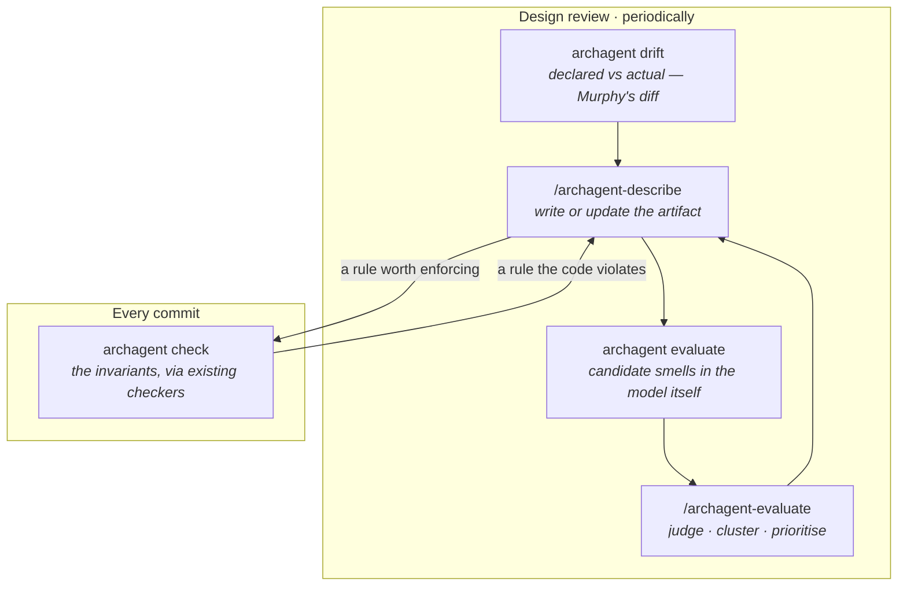

# The approach behind archagent

For someone new to the project who wants to know what it is trying to do and why. It is a narrative, not
a reference — `docs/COMMANDS.md`, `docs/CHECKING.md` and `docs/ADL-SPEC.md` are the reference.

**Contents** — [The problem](#the-problem) · [What the literature already settled](#what-the-literature-already-settled) ·
[The gap](#the-gap-nobody-closes-the-loop-back-onto-the-code) · [Four principles](#four-principles) ·
[The commands as one loop](#the-commands-as-one-loop) · [Why we think this adds value](#why-we-think-this-adds-value) ·
[What we have actually measured](#what-we-have-actually-measured) · [Related tools](#related-tools) ·
[Limits](#limits-and-what-would-change-our-mind)

---

## The problem

A coding agent working in a large repository has to reconstruct, on every task, what the system is: which
components exist, which may call which, where state lives, what must always be true. It does this from
whatever fits in its context, and it does it again from scratch the next time.

Two consequences follow, and both are observable. Agents introduce a second way of doing something that
already had a way, because they never saw the first. And they break rules the team wrote down years ago
in a document nothing checks.

The premise of this project is that **an architecture is worth writing down in a form both a person and
an agent can read, and worth mechanically checking against the code** — and that the second half is what
makes the first half survive.

We model an architecture along six dimensions, chosen because they are what someone actually needs to
answer "where does my change go?":

1. **Process topology and components** — what the pieces are and how they connect
2. **Key abstractions and patterns** — the few the system leans on
3. **State and tiering** — what state exists and where it lives
4. **Lifecycles** — how components and state move through their states
5. **Key flows** — the important end-to-end paths
6. **System-wide invariants** — what must always hold

The first two are what most tools cover. The last four are where prior work is thinnest, and are the
reason the artifact is prose and diagrams rather than a graph.

## What the literature already settled

Three things were established long before this project and are simply adopted.

**The reflexion loop.** Murphy, Notkin and Sullivan (1995) reduced architecture conformance to three set
operations over a high-level model and a mapping from source: **convergence** (declared and present),
**divergence** (present but not declared), **absence** (declared but not present). It is mechanical and
cheap — they computed it over 1.2M lines of Excel in about two minutes. Ducasse and Pollet's 2009 survey
confirms this loop is the archetype of the whole software-architecture-reconstruction field.

The intelligence is entirely in *authoring the model*. The diff itself is trivial. `archagent drift` is
that diff, and its categories are Murphy's.

**The enforceability spectrum.** Architectural rules are not uniformly checkable, and the field has a
well-worn ordering by cost: structural rules over the dependency graph (Lattix's DSM, Terra and Valente's
DCL, ArchUnit, import-linter) → contracts and property-based tests → model checking and proof. Cheap
checks catch most of what breaks; expensive ones exist for the few rules worth the cost.

archagent's `Tier` column *is* this spectrum — `structural`, `contract`, `pbt`, `model-check` — plus one
addition the literature does not have, discussed below.

**Untrusted proposer, trusted checker.** Across the recent LLM-and-verification work the same shape
recurs: let the model propose, and let a deterministic tool decide. It is the only arrangement in which a
model's unreliability is bounded rather than compounding.

This is why archagent generates configuration for import-linter, dependency-cruiser and ast-grep rather
than judging conformance itself. **The LLM only ever proposes.** Every pass or fail in `check` comes from
a tool that has been checking these things for years.

Two further findings shaped the design more than we expected.

**Agents cannot hold architectural belief unaided.** The *Theory of Code Space* work probes agents about a
codebase's structure and finds belief unstable between probes — and that keeping an externalized map as a
scratchpad measurably improves dependency recall. The artifact is not documentation-as-nicety. It is the
thing that stops the agent re-deriving, badly, what it derived yesterday.

**Never let a model rewrite the whole artifact.** The ACE work on evolving contexts found that monolithic
LLM rewriting collapses them — one reported step went from 18,282 tokens to 122, taking accuracy down
with it. The fix is itemized entries with stable identifiers, updated by small deltas merged
deterministically. It also carries a hard caveat: **this only improves things when the feedback signal is
trustworthy.** Without one, the artifact degrades.

That caveat turned out to be the hinge of the whole design.

## The gap: nobody closes the loop back onto the code

Surveying the recent agentic-architecture work, the pattern is consistent:

| | describes | extracts | diffs | enforces |
|---|---|---|---|---|
| AgenticAKM | ✓ | ✓ | ADR-vs-ADR only | ✗ |
| RAD-AI | ✓ (human prose) | ✗ | ✗ | ✗ |
| Codified Context | ✓ | ✓ | a git-commit staleness heuristic | ✗ |
| Reflexion models (1995) | ✓ | ✓ | ✓ structural | ✗ |

**The unbuilt segment is diff → enforce**, and it is most valuable exactly where prior art is thinnest —
the four behavioral dimensions.

The synthesis that made this project worth building is one sentence: **ACE needs a trustworthy signal to
improve an artifact, and the reflexion diff is exactly that signal.** Chain them and you get the spine:

> describe → extract → diff → enforce → improve

with a deterministic, non-noisy discrepancy signal in the middle keeping the evolving artifact honest.

## Four principles

**1. Seed from what exists, then verify it.** Teams already have design docs, ADRs, module docstrings and
half-true wiki pages. `describe` reads them as *hypotheses* and confirms each against the code. Where the
documented architecture and the actual one have diverged, that divergence is surfaced rather than
silently resolved — it is either a real defect or a stale design, and it is usually the most valuable
thing in the first run.

**2. Write for humans and agents, and resolve the tension by tiering.** Agents want terse, always-loaded
facts; people want narrative. Both get what they need if the artifact is split: a **hot** tier loaded
every session (the constitution, the invariants table, the index) that stays short, and **cold** documents
retrieved on demand (one per subsystem, ADRs) that can be full prose.

**3. Rules live in a markdown table, not a YAML file.** The invariants table is markdown so that a person
reviews it in a pull request and an agent edits it without a schema. It is parsed, so it compiles to real
checker configuration. One artifact, two audiences, no second source of truth.

The addition to the enforceability spectrum is a fifth tier: **`prose`** — a rule nothing can check yet.
It stays in the table, greppable and reviewable, and `check` reports it under *not checked*. Two columns,
`Verification` and `Graduation path`, say what confirms it today and what would make it mechanical.
Without them, "archagent cannot generate a checker for this" and "nobody checks this at all" are the same
empty cell, which is precisely the confusion that lets a false rule sit in a document for years.

**4. Three cadences, because the questions differ.** `check` on every commit — cheap, mechanical, a gate.
`drift` and `evaluate` at design review and periodically — informational, producing a work-list rather
than a verdict. And `describe` when the design changes. A tool that ran everything on every commit would
be ignored within a week.

## The commands as one loop

| Command | What it is, in one line | Where it comes from |
|---|---|---|
| `init` | scaffold the artifact and the agent skills | Spec-Kit's install-per-repo shape |
| `/archagent-describe` | build or update the artifact from docs + code | seed-and-verify (principle 1) |
| `check` | compile the invariants table to checker configs and run them | the enforceability spectrum |
| `drift` | declared vs actual, per category | Murphy's reflexion diff |
| `evaluate` | candidate system-level smells in the architecture itself | Arcan, Garcia's model-level smells, Taibi's microservice harms |
| `investigate` | turn one candidate into a recorded verdict | ours — the conformance literature stops at detection |
| `status`, `graph`, `lint-docs`, `modules` | is the artifact any good, and does it parse | ours |

Two of these deserve their own note.

**`evaluate` judges the model, not the code.** `check` asks *does the code obey the rules*; `evaluate`
asks *are the rules and the structure any good* — god components, dependency cycles, layering leaks,
shotgun surgery from co-change history. It emits **candidates**, never verdicts, and the
`/archagent-evaluate` skill judges them in context. Its severity counts files and commits; it says
nothing about consequence.

**`investigate` exists because the literature stops one step early.** Conformance checking detects
violations and leaves them. Deciding whether a detected smell is minor, moderate or critical requires
someone to read the code, and the answer should be recorded so the next run reports the verdict instead
of asking again.

## Why we think this adds value

Three arguments, in descending order of confidence.

**The rules already exist and nothing checks them.** Codebases are full of stated invariants — an
`# INVARIANT:` comment, an assertion message, "only the config layer reads the environment" in a design
doc. `scan-invariants` finds them; `describe` classifies and verifies them; the checkable ones become
enforced rows. The value here does not depend on the model being clever, only on it being able to read.
And a stated rule the code *violates* is surfaced as drift, which is a bug or a stale design and either
way worth knowing.

**The diff is deterministic and therefore trustworthy.** Everything `drift` reports is a set difference
between something declared and something extracted. It needs no model and cannot be argued with, which is
what makes it usable as the feedback signal ACE requires.

**The artifact pays for itself if an agent reads it.** This is the weakest of the three because it is the
hardest to measure, and we have not measured it. The externalization evidence from ToCS is
encouraging and is not the same as evidence about *this* artifact.

## What we have actually measured

This project keeps its evaluation write-ups in `docs/evaluations/` and its methodology in
`docs/designs/evaluating-archagent.md`. The short version is more mixed than the pitch above:

**What is solid.** The one signal validated predictively — `change-prone-file` — holds up: files it flags
accumulate significantly more defect-fixing commits than churn-matched controls in three of four
adequately-powered repositories. And the extraction is accurate: across a blind labelling round on
fourteen findings, **not one measurement was disputed**.

**What is not.** Blind labelling puts `scattered-source-of-truth` at 89% precision and
`enum-value-escape` at 60%, both with intervals wide enough to span "good" and "coin flip".
`layer-skip` was dismissed every time it was checked. And the most sobering number, from a calibration
round on dspy: of nineteen findings a reviewer rated for impact, **six described nothing real and five
were correct and not worth anyone's time**. Nothing reached "critical".

The three measurements together say something consistent: **the measurements are better than the
reports.** The loss is between computing a fact and telling a reader what to do about it, and that is
where the current work is.

**What is unmeasured.** Whether any of this makes an agent write better code. That is the claim the
project exists to make and the one with no evidence behind it yet.

We record the bad numbers on the same page as the good ones, and the evaluation ledger refuses to plot a
trend across rounds that used different rubrics, judges or tool builds — because three calibration means
of 3.0, 4.0 and 4.17 looked like a rising line and were three different instruments.

## Related tools

**[Archy](https://github.com/hslee16/archy)** is the closest neighbour and the comparison is instructive.
It is a Python-only *architectural sensor*: it scores the import graph on five axes, trends that score per
commit, finds cycles, ranks refactor priority by churn × complexity, and can simulate an import change
before you write it. It is mature, MCP-first, and fast on large repositories.

The difference is what the two treat as ground truth. Archy measures *general* graph properties and
reports how they trend — it needs no model of your system, which is its strength. archagent enforces
*your system's specific rules* against an artifact you author, which needs the artifact, which is a real
cost. A team wanting a continuous metric wants Archy. A team wanting "the domain layer must never import
the web layer, and here is why, and check it on every commit" wants this.

They are not exclusive, and archagent uses import-linter for the same reason Archy does.

**Spec-Kit** shaped the delivery model — install once, scaffold per repository, ship prompts as data.
**import-linter, dependency-cruiser, ast-grep, Hypothesis, fast-check** do the actual checking; archagent
is the thin layer compiling one markdown table into their configuration and mapping results back to the
rule that failed.

## Limits, and what would change our mind

**Two languages.** Python and JavaScript/TypeScript are parsed. On anything else the structural checks
have nothing to work with — and the tool now says so rather than reporting a clean result, which took
three separate bug fixes to get right.

**The artifact is a cost.** Someone has to write it, and re-running `describe` on a changed system is an
agent session, not a command. The bet is that the artifact earns that back; it is a bet.

**`evaluate` is the weakest part** and we know the number. More than half of what it reported on one real
repository was not worth acting on.

**The strongest disconfirming evidence would be** a controlled comparison where agents with the artifact
write no better code than agents without it. Nothing here rules that out, and it is the experiment the
project most needs and has not run.
