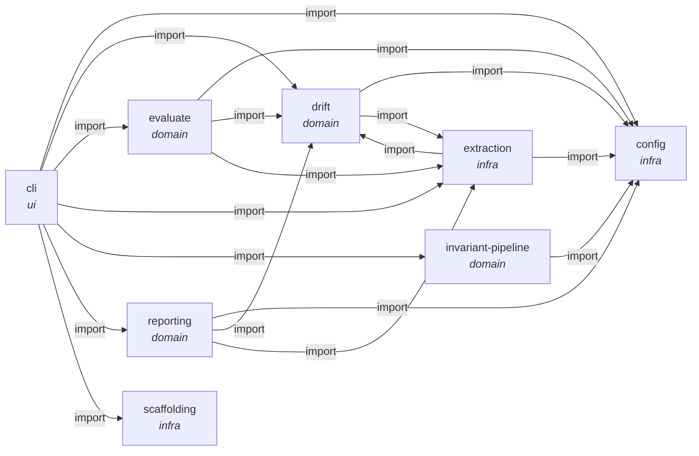

# Architecture index

archagent is a command-line tool that keeps a codebase and its architecture documents from drifting apart.
It reads a repository, writes documents describing it, and then checks those documents back against the
code — reporting where they disagree, which rules are violated, and which structural smells have appeared.

**Read in this order.** `constitution.md` first: it states the layering every other document assumes.
Then `subsystems/drift.md`, which holds the central doc-vs-code comparison, and `subsystems/evaluate.md`,
which holds the smell signals. The remaining subsystems can be read on demand.

**ADRs and invariants are not the same thing.** An ADR in `decisions/` records *why* the structure is as
it is, in prose, and binds nobody. An entry in `invariants.md` is a *mechanical* rule with a checker
behind it, enforced by `archagent check`. Some ADR conclusions are enforced by an invariant and say so;
most are not, because most are not expressible as a rule — `invariants.md` names the ones deliberately
left unwritten and why.

## System map

Generated from each subsystem's `**Connects:**` metadata by `archagent graph --write`; it is the
declared structure, so a disagreement with the code is drift and worth chasing.

<!-- archagent:graph -->

<!-- /archagent:graph -->

<!-- archagent:graph-caption -->
_**What to notice:** `cli` reaches everything and nothing reaches back — that is ADR 0001, the rule
that `cli` is the only output layer. And `drift` and `extraction` point at each other: the recorded
cycle in ADR 0003, where `drift` needs the scanners and `invscan.py` needs `drift`'s git plumbing.
The fix is to pull the plumbing into a leaf module both can import._
<!-- /archagent:graph-caption -->

| Document | What it holds |
|---|---|
| `constitution.md` | how this repo works; the layering and the deterministic-code rule |
| `invariants.md` | the checkable rules `archagent check` enforces on this repo |
| `deployment.md` | how it runs (a CLI, no services) and what it configures |
| `subsystems/cli.md` | command surface and output |
| `subsystems/config.md` | `archagent.toml` loading |
| `subsystems/invariant-pipeline.md` | invariants table -> checker configs -> results |
| `subsystems/drift.md` | doc-vs-code reflexion diff, and the shared git plumbing |
| `subsystems/evaluate.md` | system-level smell signals, including the history checks |
| `subsystems/extraction.md` | the static scanners the other subsystems read facts from |
| `subsystems/scaffolding.md` | `init` / `upgrade` and the shipped prompts |
| `subsystems/reporting.md` | coverage, module map, Mermaid lint |
| `decisions/` | ADRs — why the structure is the way it is |
| `investigations/` | what an `evaluate` finding turned out to mean (ADL-SPEC §6a) |

This artifact lives at `docs/architecture/` rather than the default `architecture/`; `archagent.toml`
records that with `architecture_dir`, and every command resolves the location from there.
