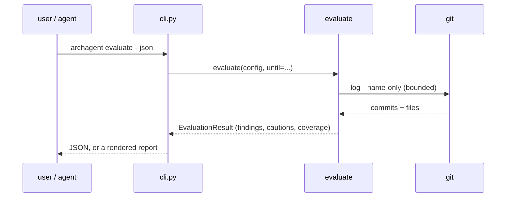

# cli — the command surface

**Covers:** `src/archagent/cli.py`, `src/archagent/__init__.py`
**Tier:** ui
**Connects:** invariant-pipeline via import, drift via import, evaluate via import, scaffolding via import, reporting via import, extraction via import, config via import

## Purpose

The only module a user or an agent talks to, and the only one that produces output. Everything below it
returns data; `cli.py` decides how it is rendered — a Rich table for a person, `--json` for an agent.

## Topology and components

One [Typer](https://typer.tiangolo.com) application with fifteen commands, each a thin adapter: parse
options, call one function, render its result. `__init__.py` exposes `main` as the `archagent` entry point
and is the only importer of this module.

The commands group by lifecycle stage: `init`/`upgrade` (scaffold), `gen`/`check` (enforce),
`drift`/`modules`/`status`/`graph`/`lint-docs` (diff and describe), `scan-invariants` (mine),
`evaluate`/`investigate`/`history-profile` (judge), `install-hook` (automate), `help` (orient).
Fifteen in seven groups, and the count is worth stating because it drifted: this document said fourteen
until `investigate` and `history-profile` were added, and nothing checks a number written in prose.

Above the commands sits one root callback carrying `--version` / `-V`. It is a callback rather than a
command on purpose — `--version` is the conventional spelling, and an `archagent version` subcommand would
be a sixteenth entry in the list above for something that is not a lifecycle step.

## Key abstractions

**Result objects, rendered late.** `run_evaluate()` returns an `EvaluationResult`; the CLI renders it
twice, as text and as JSON, from the same object (`cli.py:476-486`). Adding a field to a finding does not
touch the command.

**The JSON is a superset of the text, not a parallel format.** `--json` emits every field the rendered
report shows and some it does not — each inactive family carries the `signs` it stands for
(`cli.py:499`), so an agent can check the coverage report against the findings list rather than reading
prose. The text view collapses that to a label because a person reading a terminal does not need it.

**A clean report must mean something was checked.** `check` lists every rule `gen` skipped under *Not
checked — asserted in invariants.md, verified by nobody*, and an artifact whose rules are all `prose` tier
gets `No invariant was checked … this is not a passing run` instead of a pass. The passing line names the
count (`All 10 checked invariant(s) hold`). This came from a reviewed artifact with eight prose rules, two
of them false, where `check` printed an empty table and "All invariants hold." — ADR 0002's failure mode
arriving through the report rather than through a scan.

**A caveat about the whole report prints above the findings it qualifies.** `drift`'s *partly
unreadable* note (issue #29) comes before the categories rather than after, because a reader who has
already concluded the manifest is stale will not revise it on a footnote.

**A caveat about a number must print with the number.** `evaluate`'s severity caveat — *it counts files
and commits, never consequences* — used to live inside the triage block, so a run where nothing was marked
for investigation printed its findings with HIGH and MED severities and explained neither. Calibration
round 5 read exactly such a run on dspy, 65 findings and none flagged, and scored the report 2 of 5 on
restraint naming this. The caveat now prints with the findings and a test pins the ordering.

**Findings carry their own next step.** A finding marked `investigate` prints the exact command that acts
on it (`cli.py:538`). A reader who cannot act on a finding drops it.

**A brief's questions belong to its sign, and there is no default.** `_BRIEF_QUESTIONS` and
`_BRIEF_RATINGS` are keyed by sign. They used to be one global list written for the value-set checks, so
a `change-prone-file` brief reported churn and complexity correctly and then asked the reader to find
duplicated enum declarations and compare them member by member — which round 1's user tester named as the
most useless thing the tool told them.

The instructive part is not the wrong list but that **nothing could notice**: header, evidence and triage
reason were all sign-specific, and only the questions fell through. So a sign with no questions written
prints none and says so, rather than borrowing — another sign's read as authoritative and send a reader
looking for what is not there. The test derives the set of triaged signs from `evaluate.py` rather than
restating it, so a newly triaged sign cannot quietly inherit someone else's questionnaire.

**A heading may not be disproved by the block beneath it.** `check` printed "asserted in invariants.md,
verified by nobody" and then, six lines down, "9 state how they are verified" with the test names. The
wording predated the `Verification` column, whose whole purpose is to separate *archagent cannot compile
a checker* from *nobody checks this*, so the heading discarded the distinction the column exists to draw.
It now says the narrow true thing — not checked **by archagent** — and counts how many name their own
verification.

The blunt case stays blunt. When no skipped rule names a verification it still says so, because that is
the silence the block was written for: an artifact whose invariants are all `prose` once produced an
empty table and "All invariants hold" while two of its eight rules were false.

**Confidence is reported about the thing that was measured.** `scan-invariants` headed its first list
"high confidence", which was a claim about having found a *marker* read as a claim that the marker states
an architectural rule. Those are different, and on a real repository the gap is wide: httpx's list held
`response`, `123, 456` and `Transfer-Encoding`, all assertion messages from its test suite. The list is
now "Labelled invariants — someone wrote INVARIANT here; whether it is architectural is still yours to
judge", with assertion messages in a separate, lower tier.

Round 2's tester named this, the `check` heading above, and a high-confidence cycle built from type-only
imports as one theme: the terminal language overstating what the extractors established. All three were
wording or tiering in this module and its callers, not extraction defects — which is the same conclusion
calibration round 5 reached from the other direction.

**"This never ran" and "this ran over a partial view" are different sentences.** `evaluate`'s report has
carried the first for a while as `Inactive signals`. The second is newer and more misleading, because a
scanner reading two thirds of its sites still *produces findings* — so the run looks like it worked.
`Incomplete extraction` names those, and says what the findings then are: a floor, not a census.

Only unsound extractors are listed. Reporting everything that went right is how the part that went wrong
gets skipped, and the coverage report already scored full marks in calibration round 5 by naming what was
missing rather than everything that was fine.

**A number is presented with the confidence its evidence supports.** `status` led with 100% coverage in a
full-width green bar while its own depth table marked the same subsystem `thin` at 3.6 words per file. The
number was right; the impression was not. The table now says it counts *files claimed by a glob*, the
`Described` contrast sits directly beneath it rather than forty lines below, and green is withheld when
depth or description disagree — while staying reachable, so it still carries information.

**`init` prints what it configured, and it is the CLI that renders it.** `init.py` returns a list of
`Setting` rows — value, provenance, and a problem string where one looks wrong — and this module decides
how they look. The layering rule is what forces that split, and it pays here: the same rows are what a
future `--json` would emit without touching the detection.

**Commands that write into the artifact name one file, and it is `README.md`.** `graph --write` splices
the system map and the provenance stamp into the artifact's `README.md` (issue #28) — forges render that
name when a reader opens a directory and render nothing otherwise. The help text says so, because a flag
whose target a reader has to guess is one they will point at the wrong file.

**A new drift category needs a renderer and a JSON key, and forgetting either is silent.** `mistiered`
(issue #26) is reported in both, alongside a one-line instruction naming the tier to use — a finding that
tells a reader what is wrong without telling them what to type is one they postpone.

**Output is written for a pipe, not only for a terminal.** `--version` prints with a bare `print()` rather
than through rich, which would highlight a bare version as a number and emit colour codes into whatever is
capturing it. The same concern runs the other way in `check`, which strips ANSI from the tools it shells
out to: a subprocess that decides it is talking to a terminal returns coloured text, and a parser matching
on that text silently stops matching.

**The version is read from the installed distribution, never hard-coded.** `__init__.py` asks
`importlib.metadata` and falls back to `0+unknown` from a bare source tree. A constant in the source could
disagree with the wheel that is running, which defeats the reason the flag exists: `docs/RELEASING.md`
verifies a release by invoking the CLI, and that only proves *a* build starts unless it can say which one.

## State and tiering

Stateless. Every command reads the filesystem and git, writes at most to `.archagent/` or the artifact,
and exits. Nothing is cached in process.

## Lifecycles

None — no command has states. A lifecycle diagram here would be decoration.

## Key flows

_The shape every command takes: the CLI holds no logic, and the same result object serves both output
modes. The git call is the only external process in this path._

## Invariants

- STR-001 — `print()` appears only here.
- STR-002, STR-003 — and so do `typer` and `rich`. These exist because BND-001, BND-002 and STR-001 all
  enforce ADR 0001 and all three are evaded by a domain module importing the CLI framework directly:
  planting `import typer` in `evaluate.py` leaves BND-001 passing.
- BND-001, BND-002 — nothing below imports this module.
