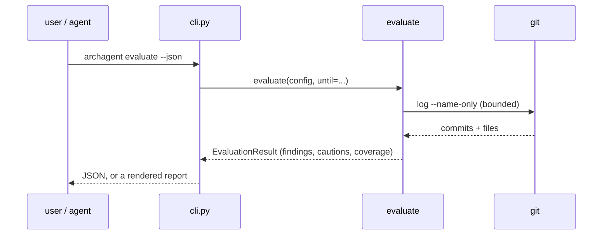

# cli — the command surface

**Covers:** `src/archagent/cli.py`, `src/archagent/__init__.py`
**Tier:** ui
**Connects:** invariant-pipeline via import, drift via import, evaluate via import, scaffolding via import, reporting via import, extraction via import, config via import

## Purpose

The only module a user or an agent talks to, and the only one that produces output. Everything below it
returns data; `cli.py` decides how it is rendered — a Rich table for a person, `--json` for an agent.

## Topology and components

One [Typer](https://typer.tiangolo.com) application with fifteen commands, each a thin adapter: parse
options, call one function, render its result. `__init__.py` exposes `main` as the `archagent` entry point
and is the only importer of this module.

The commands group by lifecycle stage: `init`/`upgrade` (scaffold), `gen`/`check` (enforce),
`drift`/`modules`/`status`/`graph`/`lint-docs` (diff and describe), `scan-invariants` (mine),
`evaluate`/`investigate`/`history-profile` (judge), `install-hook` (automate), `help` (orient).
Fifteen in seven groups, and the count is worth stating because it drifted: this document said fourteen
until `investigate` and `history-profile` were added, and nothing checks a number written in prose.

Above the commands sits one root callback carrying `--version` / `-V`. It is a callback rather than a
command on purpose — `--version` is the conventional spelling, and an `archagent version` subcommand would
be a sixteenth entry in the list above for something that is not a lifecycle step.

## Key abstractions

**Result objects, rendered late.** `run_evaluate()` returns an `EvaluationResult`; the CLI renders it
twice, as text and as JSON, from the same object (`cli.py:476-486`). Adding a field to a finding does not
touch the command.

**The JSON is a superset of the text, not a parallel format.** `--json` emits every field the rendered
report shows and some it does not — each inactive family carries the `signs` it stands for
(`cli.py:499`), so an agent can check the coverage report against the findings list rather than reading
prose. The text view collapses that to a label because a person reading a terminal does not need it.

**A clean report must mean something was checked.** `check` lists every rule `gen` skipped under *Not
checked — asserted in invariants.md, verified by nobody*, and an artifact whose rules are all `prose` tier
gets `No invariant was checked … this is not a passing run` instead of a pass. The passing line names the
count (`All 10 checked invariant(s) hold`). This came from a reviewed artifact with eight prose rules, two
of them false, where `check` printed an empty table and "All invariants hold." — ADR 0002's failure mode
arriving through the report rather than through a scan.

**Findings carry their own next step.** A finding marked `investigate` prints the exact command that acts
on it (`cli.py:538`). A reader who cannot act on a finding drops it.

**A new drift category needs a renderer and a JSON key, and forgetting either is silent.** `mistiered`
(issue #26) is reported in both, alongside a one-line instruction naming the tier to use — a finding that
tells a reader what is wrong without telling them what to type is one they postpone.

**Output is written for a pipe, not only for a terminal.** `--version` prints with a bare `print()` rather
than through rich, which would highlight a bare version as a number and emit colour codes into whatever is
capturing it. The same concern runs the other way in `check`, which strips ANSI from the tools it shells
out to: a subprocess that decides it is talking to a terminal returns coloured text, and a parser matching
on that text silently stops matching.

**The version is read from the installed distribution, never hard-coded.** `__init__.py` asks
`importlib.metadata` and falls back to `0+unknown` from a bare source tree. A constant in the source could
disagree with the wheel that is running, which defeats the reason the flag exists: `docs/RELEASING.md`
verifies a release by invoking the CLI, and that only proves *a* build starts unless it can say which one.

## State and tiering

Stateless. Every command reads the filesystem and git, writes at most to `.archagent/` or the artifact,
and exits. Nothing is cached in process.

## Lifecycles

None — no command has states. A lifecycle diagram here would be decoration.

## Key flows

_The shape every command takes: the CLI holds no logic, and the same result object serves both output
modes. The git call is the only external process in this path._

## Invariants

- STR-001 — `print()` appears only here.
- STR-002, STR-003 — and so do `typer` and `rich`. These exist because BND-001, BND-002 and STR-001 all
  enforce ADR 0001 and all three are evaded by a domain module importing the CLI framework directly:
  planting `import typer` in `evaluate.py` leaves BND-001 passing.
- BND-001, BND-002 — nothing below imports this module.
