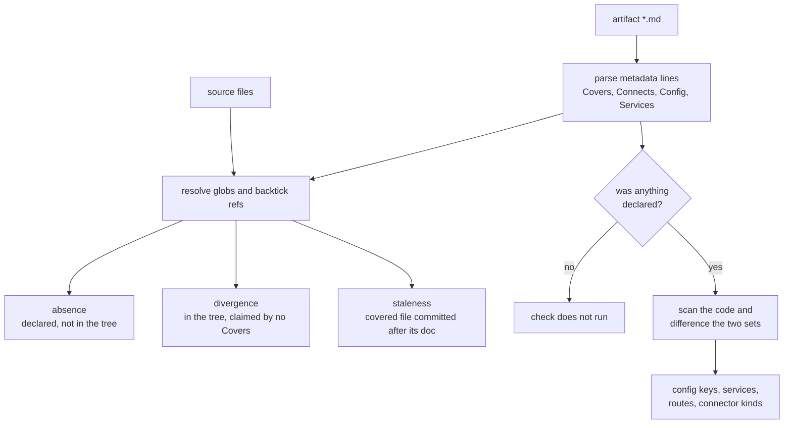

# drift — the reflexion diff, and the plumbing under it

**Covers:** `src/archagent/drift.py`
**Tier:** domain
**Connects:** config via import, extraction via import

## Purpose

Answers "does the description still match the code?" — dangling references, stale documents, undocumented
code, undeclared dependencies, config keys read but not declared, routes and services that have drifted.

It also holds the shared git and source-file plumbing the rest of the tool stands on. That is a known cost,
recorded in ADR 0003 rather than hidden.

## Topology and components

Two things in one module:

**The drift check** — `find_drift(config, until=None)` returns a `DriftResult` of typed lists.

**The plumbing** — `_git`, `_git_available`, `_source_files`, `_import_graph`, `_glob_files`,
`_covers_globs`, `_is_subsystem`, `_service_of`, `_connectors`. Seven modules import these; most want only
these.

## Key abstractions

**`_git` returns `None` on failure**, and callers that cannot distinguish failure from emptiness must check
(ADR 0002). Its timeout is a parameter because a single-fact query and a full-history walk have different
budgets — 30s suits the former, and 30s silently truncated the latter on a large repository.

**A reference that cannot be verified is not a reference that is wrong.** `_resolve_ref` reports a doc
reference as dangling only after checking the filesystem, not just the configured-language file set. Two
cases forced this, both found on a Go-majority repository: a wildcard **Covers:** glob fails a literal
`exists()` and was reported as missing code, and an accurate citation of a Go entry point resolved to
nothing because Go is not analysed. Saying "this names code that no longer exists" about a file sitting
in the tree is worse than saying nothing.

Two later false positives came from the same direction. **A literal path can contain glob
metacharacters** — every Next.js App Router dynamic segment does, `[id]`, `[...path]`, `[[...slug]]` — and
routing anything bracketed to glob matching turns those brackets into a character class that matches none
of them, so a file sitting in the tree was reported missing. A pattern that matches nothing now falls
through to the ordinary lookups. And **a bare extension in backticks is not a file reference**: prose like
"the suite is `` `.ts` `` only" was read as naming code that no longer exists, a dangling finding against
a document that cited no file at all.

Both were found by describing a repository unlike anything in the corpus, which is the argument for
keeping the corpus varied rather than large.

(Written without a sample filename on purpose. A made-up path in backticks is indistinguishable from a
real citation, so this check flags it — twice, while this paragraph was being written, including once in
the sentence explaining the problem.)

**A subsystem can claim a layer it has no business on, and that is drift rather than a smell.**
`_mistiered` reports a subsystem whose covered files are *entirely* test, migration or script code while
declaring a production `**Tier:**`. The artifact is asserting something about the code that the code
contradicts, which is this command's question, not `evaluate`'s.

Issue #26 is why: four of seven labelled `layer-inversion` findings came from packages tiered `infra` —
the bottom rank — so everything the tests imported read as upward. Correcting the two tiers on wardrowbe
takes that signal from seven findings to two, dropping exactly the five a reviewer dismissed.

**A type-only import is not a runtime dependency, and not nothing either.** `_imports_of` partitions
rather than filters: imports inside `if TYPE_CHECKING:` are excluded from the runtime graph and returned
by the same function under `type_only=True`. Everything structural reads the runtime graph, because a
dependency that exists only for a type checker is not a cycle, not a layer violation and not fan-in.

The idiom is why this was systematic rather than incidental. A type-only back-edge is *how* a Python
project breaks a real import cycle, so the graph was most wrong exactly where the code was most careful.
On httpx, the exceptions module's only internal import of a sibling sits inside
`if typing.TYPE_CHECKING:`, and the graph reported a two-node cycle between it and the models module —
which round 2's tester disproved by opening the file, and which had been reported at high confidence
(#37). (Named in prose rather than backticks: those are another repository's paths, and this check
correctly reads a backticked filename as a citation of *this* one. It caught the first draft of this
paragraph, which is the third time that has happened while documenting this module.)

**Import extraction is tested by an enumerated matrix, not by whichever repositories we cloned.**
`tests/shapes.py` holds one small fixture per idiom — layouts, package initialisers, type-only guards,
import forms — and asserts the extracted graph completely, so a spurious edge fails a cell as surely as a
missing one. Sixteen cells run in about a second; litellm alone is 132 MiB and a ninety-second git walk.

The reason is that a matrix is *enumerable*. Every idiom-shaped defect in this module went unnoticed
because the corpus happened not to contain that idiom, and no amount of reading six repositories reveals
which one is absent. Building the table immediately turned up an aliased `TYPE_CHECKING` guard the
narrower fix had missed. A test ties the table to the matrix in `docs/designs/extraction-confidence.md`,
so a shape can be proposed in the design and cannot then be forgotten in the code.

**A package initialiser is its own package, and `level` counts from there.** Relative-import resolution
stripped one component too many in every `__init__.py`, because it treated the file's module name as a
module *inside* a package when for an initialiser the file **is** the package. On httpx the effect was
total: a root package whose entire body is `from ._api import *` style re-exports produced **no edges at
all**, so correctly declared connectors read as stale.

That is the worst shape this command can take — it penalised the accurate artifact and would have gone
green only if the author made the documentation wrong. Round 2's tester hit exactly that and declined,
which is how it was found.

The star import is where it was noticed, not the cause: `from . import x` and `from .m import Name`
misresolved identically. A package initialiser is where re-exports live, so it is the file whose edges
matter most for a declared connector to be corroborated.

**The two drift directions treat those edges differently, on purpose.** A type-only import *suppresses*
a `stale` finding, because the coupling is real at design time and telling an author their accurate
declaration is stale punishes the accurate artifact. It never *creates* an `undeclared` finding, because
requiring documentation for an edge the running system does not have would push authors to describe
couplings that do not exist. `else:` branches stay runtime, and `if not TYPE_CHECKING:` is deliberately
not matched — the safe direction is the one that keeps a real edge.

The predicate behind "is this test code" is `configscan.is_test_path`, imported rather than reimplemented.
That is deliberate and load-bearing: `evaluate` asks the same question of the same files when it decides
which reading of a hard-coded endpoint applies, and two definitions would let the two commands disagree
about whether a given file is a test — one exempting it from documentation while the other treats it as
production. The edge to `extraction` is the price of that agreement.

**Every** covered file must be non-production, not merely most. A subsystem holding production code beside
its tests is a production subsystem and belongs on the ladder; flagging it would relocate the false
positives rather than remove them. That strictness is also why the check catches two of the four known
cases and not four — one of the misses keeps its startup and seed files in the application package under
no distinguishing path, and guessing from a filename is the heuristic this module has twice been burned
by.

**A key the deployment reads is read.** The config comparison subtracts `deployment_config_keys` as well
as the code's, and the asymmetry is deliberate: the deployment's keys suppress a *dangling* finding but
never create an *undocumented* one. Compose interpolation picks up image tags and port numbers, and
counting each as part of the configuration surface would trade two dozen false dangling findings for two
dozen false undocumented ones.

Not fixed by this, and a different shape: a key read by code in a language archagent cannot parse. All
seven of obstudio's remaining dangling keys are read by its Go core, and two are *written* by the
TypeScript extension for that Go process to read — a write is not a read, and the reader is invisible.

**A source path of `.` means the repository root, and for a long time it meant nothing.** `_module_of`
built its prefix as `sp + "/"`, so `"."` became `"./"` and no path started with it — a repository whose
package sits at the root (`dspy/`, `requests/`, `flask/`) resolved **no modules at all**. Every target
archagent had been run against used the other standard layout, `src/` or `backend/`, which is why it
survived until a flat-layout repository was tried.

Silent and total, in the usual shape: no modules means an empty import graph, so BOUNDARY contracts scope
to nothing, every structural signal reports nothing, and `check` says all invariants hold. `archagent
modules` is the one-command diagnostic for exactly this, and it said "No Python modules resolved" — which
is why the command exists.

**`lstrip("./")` strips a set of characters, not a prefix.** `_resolve_ref` used it, so
a path like .github/workflows/ci.py became github/workflows/ci.py and and .env.example became env.example — every
path under a dot-directory resolved to one that does not exist and was reported as a dangling reference.
`removeprefix("./")` is what was meant. Found on dspy, whose artifact legitimately covers a file under
`.github/`.

**Every check here compares a declaration against something found in code — so code it cannot parse is
code it cannot find.** `_unparsed_languages` counts source files in languages outside the configured set
and, above a small floor, says so. On obstudio five correctly-declared config keys are reported as never
read because `os.Getenv` in Go is invisible: accurate about what was scanned, misleading about what
exists.

It is never counted as drift. It is the caveat that makes the drift findings readable, and it is the same
remedy #25 applied in `evaluate` — the tool cannot see everything, and the honest move is to say which
part it could not see rather than to report a clean half as a whole.

**Every git-reading path takes `until`.** Three of them needed it and only two were obvious: the miner, the
staleness comparison, and — the one that was missed — the commit-wording profile, which would otherwise
learn from commits after a cutoff and use them to label commits before it.

## State and tiering

Reads the git object store and the working tree. Writes nothing.

## Lifecycles / key flows

No lifecycle — `find_drift` is one pass with no states. The flow is a fan-out from a single parse:

_Every result is a set difference in one of two directions — declared-but-absent, or present-but-undeclared
— which is why `drift` needs no model and cannot be argued with. **The branch on the right is the one to
notice:** the config, services and route checks only run when the artifact declares something to compare
against (`drift.py:157`, `:166`). Say nothing about configuration and the configuration check reports
nothing, which reads identically to agreement. A silent drift report can mean the documents are accurate
or that they are too empty to contradict, and nothing in the output distinguishes those — which is exactly
why the evaluation rubric pairs a drift score with a specificity score rather than quoting drift alone._

## Invariants

- BND-002 — does not import the CLI.
- BND-003, STR-005 — `config` must never import this, keeping the hub dependency one-way.
- STR-004 — **`git` is invoked only here**, and this is now checked rather than left to review. The
  pattern is the string literal `"git"`, which matches `drift.py:288` and nothing outside this module.
