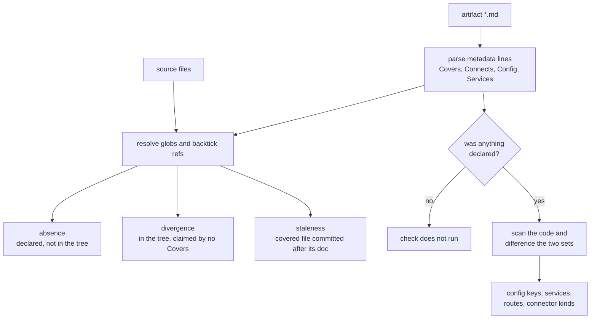

# drift — the reflexion diff, and the plumbing under it

**Covers:** `src/archagent/drift.py`
**Tier:** domain
**Connects:** config via import, extraction via import

## Purpose

Answers "does the description still match the code?" — dangling references, stale documents, undocumented
code, undeclared dependencies, config keys read but not declared, routes and services that have drifted.

It also holds the shared git and source-file plumbing the rest of the tool stands on. That is a known cost,
recorded in ADR 0003 rather than hidden.

## Topology and components

Two things in one module:

**The drift check** — `find_drift(config, until=None)` returns a `DriftResult` of typed lists.

**The plumbing** — `_git`, `_git_available`, `_source_files`, `_import_graph`, `_glob_files`,
`_covers_globs`, `_is_subsystem`, `_service_of`, `_connectors`. Seven modules import these; most want only
these.

## Key abstractions

**`_git` returns `None` on failure**, and callers that cannot distinguish failure from emptiness must check
(ADR 0002). Its timeout is a parameter because a single-fact query and a full-history walk have different
budgets — 30s suits the former, and 30s silently truncated the latter on a large repository.

**Every git-reading path takes `until`.** Three of them needed it and only two were obvious: the miner, the
staleness comparison, and — the one that was missed — the commit-wording profile, which would otherwise
learn from commits after a cutoff and use them to label commits before it.

## State and tiering

Reads the git object store and the working tree. Writes nothing.

## Lifecycles / key flows

No lifecycle — `find_drift` is one pass with no states. The flow is a fan-out from a single parse:

_Every result is a set difference in one of two directions — declared-but-absent, or present-but-undeclared
— which is why `drift` needs no model and cannot be argued with. **The branch on the right is the one to
notice:** the config, services and route checks only run when the artifact declares something to compare
against (`drift.py:157`, `:166`). Say nothing about configuration and the configuration check reports
nothing, which reads identically to agreement. A silent drift report can mean the documents are accurate
or that they are too empty to contradict, and nothing in the output distinguishes those — which is exactly
why the evaluation rubric pairs a drift score with a specificity score rather than quoting drift alone._

## Invariants

- BND-002 — does not import the CLI.
- BND-003, STR-005 — `config` must never import this, keeping the hub dependency one-way.
- STR-004 — **`git` is invoked only here**, and this is now checked rather than left to review. The
  pattern is the string literal `"git"`, which matches `drift.py:288` and nothing outside this module.
