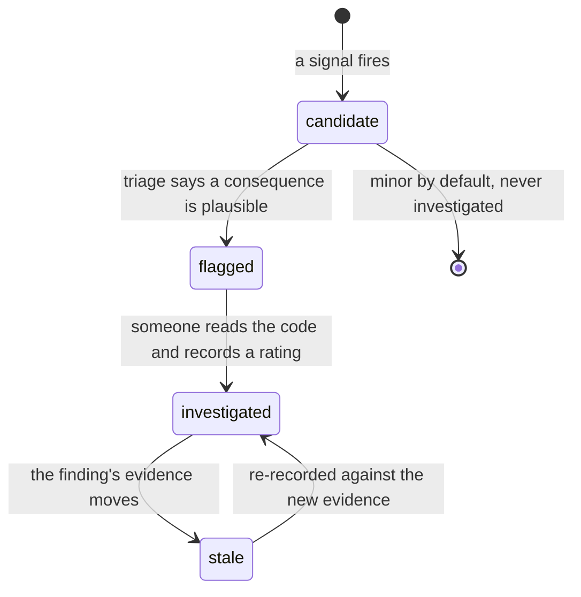
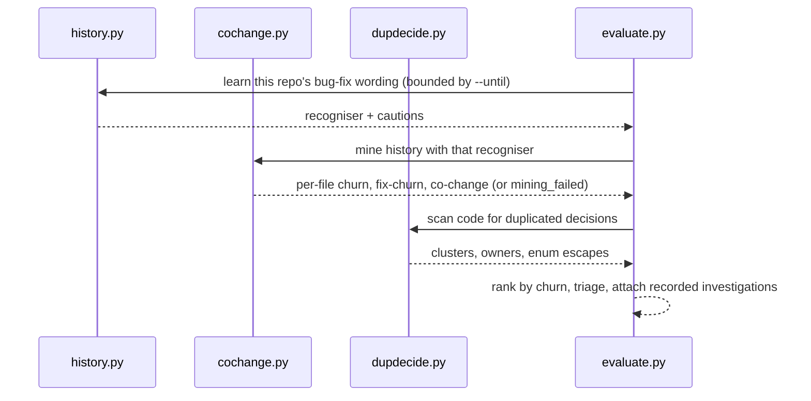

# evaluate — system-level smell signals

**Covers:** `src/archagent/evaluate.py`, `src/archagent/cochange.py`, `src/archagent/hotspots.py`, `src/archagent/dupdecide.py`, `src/archagent/history.py`, `src/archagent/investigations.py`
**Tier:** domain
**Connects:** config via import, drift via import, extraction via import

## Purpose

Asks whether the architecture is *healthy*, as distinct from whether it matches the docs. Produces
**candidate signals** — a signal is a measurement that *might* indicate a problem, never a verdict — which
a person or an agent then judges. `--group` filters them.

## The six groups

The letters appear throughout this document, the CLI and the report, so they are worth having up front.
Each is a family of signals sharing an evidence source.

| Group | Evidence it reads | Signals |
|---|---|---|
| A | declared data ownership | `duplicated-source-of-truth`, `shared-persistency`, `service-intimacy`, `shared-library` |
| B | the import/connector graph and git co-change | `layer-inversion`, `layer-skip`, `unstable-dependency`, `unstable-interface`, `implicit-coupling`, `extraneous-adjacent-connector` |
| C | subsystem shape | `god-component`, `cycle-*`, `distributed-monolith` |
| D | deployment, observability and exposure scans | `hardcoded-endpoint`, `no-request-tracing`, `trace-chain-gap`, `permissive-origin`, `server-side-fetch` |
| E | git history per file | `change-prone-file` |
| F | duplicated decisions in source | `scattered-source-of-truth`, `enum-value-escape` |

A, C and D are computed from the artifact and the code alone. E needs git history. **B and F are each
half-and-half**, which is worth stating precisely because getting it wrong produced a bug: B's layering
signals are static while `implicit-coupling` and `unstable-interface` come from co-change, and F's
`scattered-source-of-truth` needs history to rank duplications while `enum-value-escape` is a pure code
scan that runs with no git at all (`evaluate.py:310-312`).

That last one is easy to get wrong. The coverage report used to name `B/E/F — git history` as inactive
under `--no-history`, so a run could report an enum escape and, in the same output, say the family it
came from had been skipped. Corrected: the label now names B, E and *F's history-ranked half* only.

**And the claim is now machine-checkable.** Each `Inactive` entry carries the `signs` it stands for, not
just a prose label, and a test asserts no reported sign appears in an inactive entry. The previous tests
matched the substring `"git history"`, which the buggy and the fixed label both contain — they passed
either way and could not have caught it. `signs` is empty where a family is *degraded* rather than
absent: `E — bug-fix weighting` still emits `change-prone-file`, ranked on total churn.

**Churn** means one thing throughout: the number of commits touching a file in the analysed window.
*Fix-churn* is the subset of those commits the recogniser labelled as bug fixes. Both are compared as
percentiles within the repository, never as absolute counts — a hundred commits is a lot in one project
and a quiet month in another.

## Topology and components

`evaluate.py` is the composition root: it builds a subsystem model from the artifact, runs each signal
family, and assembles an `EvaluationResult`. The history-based checks live in their own modules:

| Module | Signal |
|---|---|
| `cochange.py` | subsystem co-change, plus per-file churn (total and bug-fix-labelled) |
| `history.py` | the learned per-repo bug-fix commit recogniser everything else weights by |
| `hotspots.py` | group E — churn x indentation-complexity, both as within-repo percentiles |
| `dupdecide.py` | group F — one decision branched on across files; enums bypassed by raw strings |
| `investigations.py` | recorded verdicts, so an answered finding stops asking |

## Key abstractions

**Learning from the artifact means not learning archagent's own scaffolding.** `history.py`'s domain
terms are read from every `**Bold** —` line under the architecture directory, and archagent scaffolds
documents written in exactly that style — so httpx's "project vocabulary" included `Columns` and `Record
every invariant as a row`, both from the shipped `invariants.md` template, and `--write` cached them.

That is a feedback loop rather than a noisy heuristic: the tool scaffolds, learns from what it scaffolded,
and stores the result as evidence about the target. It strengthens as more scaffolding appears and stays
invisible because the terms read as plausible. `_scaffold_terms` subtracts the templates' own vocabulary
— subtracting terms rather than skipping files, because a user who edits `invariants.md` and leaves its
preamble is the normal case and a file-identity check would stop recognising it the moment they touched
it. The cost is recorded: a project whose real glossary defines one of those words loses that term.

**Learn the project's vocabulary, do not hardcode it.** A fixed `fix(...)` matcher finds **zero** of
Django's ~16,000 fix commits. `history.py` learns each repository's wording from its own commits and
guidelines.

**`Basis` separates what produced a finding from what anyone should conclude.** The deterministic layer
can establish four things: which rule fired, what it counted, where the evidence is, and what it could not
determine. Severity and priority are not among them, because both depend on consequence.

The fourth field is the new one. `_mark_unverified` used to *append* its caveat to `detail`, which put a
statement about evidence inside the sentence reporting the count; it now sets `unestablished`, and that
separation is the point. `as_basis()` derives a default from a finding's existing fields, so the renderer
could lead with evidence for every sign at once rather than only for converted producers.

**Findings are candidates with a stable identity.** Each carries an id (`sign:owner:hash`) that survives
re-runs, so a label or an investigation attaches to the finding rather than to a run.

That identity has to distinguish findings that differ, and for two years it did not. Only group F passes
a value set, so every other sign hashed the empty string — `da39a3ee` — and the id collapsed to
`sign:subjects[0]`. Two `layer-inversion` findings out of one subsystem were the same id, which round 2's
user tester spotted in the output (#36). Since the id keys the label store and `investigations/`, the
consequence was not cosmetic: a recorded verdict could answer a finding nobody investigated.

Every subject now participates, in order — `a -> b` and `b -> a` are different claims — while values stay
sorted because they are a set. The encoding leaves single-subject ids byte-identical, so of the 176 ids
recorded across the evaluation data the 151 unambiguous ones keep their labels and only the 25 broken
ones move; a migration re-keyed the 12 that had human verdicts attached, each proved against its own
recorded subjects before being rewritten.

**The dependency graph is parsed *and* declared.** `model.edges` starts from the import graph and then
takes in every `**Connects:** … via import` edge the artifact declares. DD-4 is the reason: the intended
model is ground truth and inference corroborates it, so a dependency the author declared is a dependency
whether or not archagent can parse the language it lives in.

Without this, every structural signal was inert on a Go, Rust or Java majority repository — and said
nothing. obstudio declares ten subsystems and seventeen connectors and produced **zero** code-derived
edges, so six signals silently found nothing and the deterministic rubric scored the artifact 1.00 on
*evaluate signal families active*: a perfect coverage mark over a gap no reader could see.

Two things keep the trust bounded. **Only `via import` edges join** — an `async-event` connector is not a
code dependency, and treating one as such would manufacture layering violations out of a message queue.
And **a finding resting on an edge no parsed import corroborates is downgraded one confidence notch and
says so in its detail**, because reporting a taken-on-trust finding identically to a measured one erases
the distinction DD-4 draws. When the whole graph is declared, the coverage report names that too, with an
empty `signs` list — those families are degraded rather than absent, and listing their signs would
contradict the findings in the same report.

Measured before shipping: on archagent, wardrowbe and fastapi-template the union adds **zero** edges,
because `drift` reports any declared/actual disagreement as undeclared or stale, so a maintained artifact
already agrees with its code. The entire effect falls on repositories archagent cannot parse.

**A tier token can say *not a layer*, and that is not the same as saying nothing.** The vocabulary lives
in `tiers.py` (issue #26): `test`, `migration`, `ops` and friends are recognised and carry no rank, so the
layering checks skip those subsystems. An unrecognised token was already skipped, so this buys no new
behaviour — it buys the difference between a deliberate choice and a typo, which a silent skip cannot
express.

The coverage report counts **rankable** tiers, not declared ones. A repository with `domain` on one
subsystem and `test` on another has two `**Tier:**` lines and nothing the layering check can compare, so
counting declarations would report the family active over a comparison that never happened.

**Severity is mechanical; a rating is not.** `severity` counts files and commits. Whether something is
minor, moderate or critical depends on what it *causes*, which only reading the code establishes — so
findings that might have consequences are marked for investigation rather than rated.

**A language that parses to nothing is reported before its silence is read as health.**
`_language_coverage` names any configured language that contains a substantial number of files and
yields no import edge from any of them. That is the whole class the wardrowbe defect belonged to: its
frontend graph held 3 edges across 119 TypeScript files, every structural signal over those subsystems
had almost nothing to work from, and the report said nothing — because "no findings" and "nothing to
find" are the same output.

The threshold exists so the check means something: below ten files, "no internal imports" is ordinary
rather than evidence. And it reports during the run that produced the findings, which was the argument
for it over the alternative of recording an edge count in the evaluation ledger — that would have let
someone notice a year later.

**A partial scan is reported beside the findings, not instead of them.** `_extraction_coverage` asks each
scanner what it could not resolve and keeps only the answers that admit a gap. That is a different
statement from `Inactive`, and the more misleading one to omit: an inactive family produced nothing, while
a partial scan produces findings and therefore looks like a working result. Its findings are a floor
rather than a census.

Sound extractors are dropped rather than listed, on the same reasoning that earned the coverage report 5
of 5 in calibration round 5 — it names what is missing, not everything that is fine, and a report that
lists its successes is one whose failures get skipped.

**A recommendation may only say what the finding measured.** Every recommendation used to be a constant
string, so a finding computed specifics and then advised in the abstract: `god-component` knew which files
other subsystems reach for — fan-in was derived from exactly those edges — and said "split along its
internal seams". Calibration round 5 scored `finding_actionability` 2 of 5 and rated 11 of 19 sampled
findings as noise, while the underlying measurements went undisputed. The gap was never in the extraction.

So the interpolation is not decoration. `_external_pull` re-reads the file-level import graph to name the
externally-imported files and separate the internal-only ones, `_shared_files` cites a co-change commit
and the files it touched on each side, and both co-change findings state what would make them noise. The
constraint this creates is that a recommendation must **withdraw** when the evidence does not support it:
when every file of a god component is reached from outside there is no body to extract, and the finding
says so instead of repeating generic advice. The same rule removed "keeps forcing" — four co-changes are
four observations, and the phrase asserted a habit — from the findings and from the shipped `evaluate`
prompt, which had been telling the agent the same thing before it judged anything.

**A finding whose subject changes meaning must change reading, not disappear.** `hardcoded-endpoint` in
production code is about *pinning*: the address travels with the code. In a test that reading is simply
false — a test has no environment to be pinned to — and on dspy it produced a recommendation to move a
deliberately unreachable fixture address into service discovery. Skipping test paths would have traded one
error for another, because a routable address in a test is a real signal about hermeticity. The check
reports the same measurement with the consequence that applies, at reduced severity. Addresses the IETF
reserved for documentation or made unroutable are dropped everywhere, since they can be neither.

**A documentation example is not infrastructure.** The endpoint scan skipped lines that *start* with a
comment marker, which catches a commented-out URL and nothing else. On httpx that left 8 of 11 endpoint
findings pointing at prose — `httpx.URL("https://[::ffff:192.168.0.1]")` inside a docstring demonstrating
URL normalisation, reported `med` as a hard-coded deployment endpoint. `_docstring_lines` takes the
ranges from an `ast` walk, including bare string *expressions* rather than only `__doc__` docstrings,
because a code fence inside a doc block parses as one and a reader cannot tell them apart. A file that
will not parse yields no ranges rather than raising: this is a heuristic improving a heuristic, and a
syntax error should cost the filter, not the scan.

**One finding per file, not per line.** Removing the docstring hits exposed the next layer: httpx's URL
suite names addresses on 23 lines of a single file, and as 23 findings that is a census of one fact which
buries everything else in the report. Endpoint findings collapse per file under `MAX_ORIGIN_SITES`, the
same cap and the same reasoning as the origin sites.

**The two exposure signals in group D are architectural findings, not a security scan.** Both ask a
question about the shape of the system that no linter positioned inside one file can ask, and both refuse
to state more than the evidence supports.

`permissive-origin` fires on a wildcard `Access-Control-Allow-Origin`, an unconditional WebSocket
`CheckOrigin`, or wildcard CORS middleware — but it is only rated high when the *same service* also
registers a state-changing route. That pairing is the whole finding: a permissive origin on a read-only
surface is a different thing from one on a surface that accepts writes, and only the subsystem model knows
which service a route belongs to. The severity rule deliberately gives no weight to "it binds to
localhost", because that is not a restriction — a browser on any site can reach `127.0.0.1`.

`server-side-fetch` reports request input reaching an outbound HTTP call, and reports it *together with
whatever guard it found* rather than as a verdict. The distinction the finding exists to draw is that a
scheme or prefix check constrains what the string looks like and never where the request goes, so a guard
being present is not evidence the shape is safe — but a reader cannot judge that without being shown the
guard, and a finding that hides it invites both dismissal and panic.

## State and tiering

Git history (read), the artifact (read), `<arch-dir>/investigations/` (read; written by `investigate`),
`.archagent/history-profile.json` (read).

## Lifecycles

_A finding's life. The transition worth noticing is `investigated -> stale`: a recorded verdict was about
the finding as it stood, so when the set of involved files changes the verdict is shown but the question
reopens rather than a stale answer being presented as current._

## Key flows

_Why the order matters: the recogniser is learned first because every later weighting depends on it, and
it must be learned from the same window the mining uses or the run leaks future information into a
past-bounded measurement._

## Invariants

- BND-001 — does not import the CLI.
- STR-002, STR-003 — and does not reach the terminal by importing `typer` or `rich` directly, which BND-001
  alone does not prevent.
- BND-004 — `hotspots` must not import `dupdecide`; the dependency runs the other way. Planting that
  import to test the rule produced an immediate circular-import crash at startup, which is what the rule
  is protecting against.
- STR-006 — `hotspots` imports nothing internal at all, which is the property BND-004 approximates with
  one edge.
