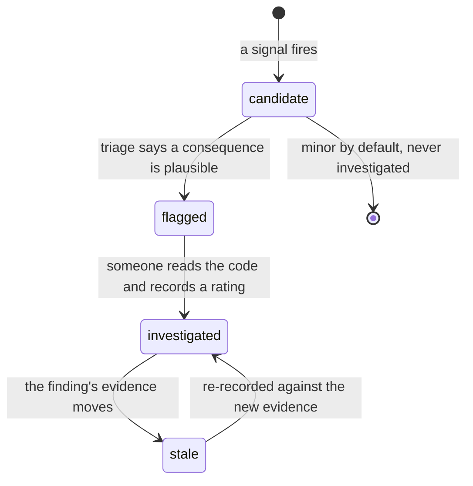
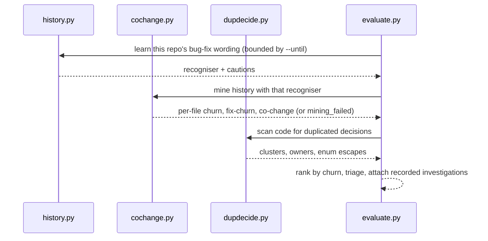

# evaluate — system-level smell signals

**Covers:** `src/archagent/evaluate.py`, `src/archagent/cochange.py`, `src/archagent/hotspots.py`, `src/archagent/dupdecide.py`, `src/archagent/history.py`, `src/archagent/investigations.py`
**Tier:** domain
**Connects:** config via import, drift via import, extraction via import

## Purpose

Asks whether the architecture is *healthy*, as distinct from whether it matches the docs. Produces
**candidate signals** — a signal is a measurement that *might* indicate a problem, never a verdict — which
a person or an agent then judges. `--group` filters them.

## The six groups

The letters appear throughout this document, the CLI and the report, so they are worth having up front.
Each is a family of signals sharing an evidence source.

| Group | Evidence it reads | Signals |
|---|---|---|
| A | declared data ownership | `duplicated-source-of-truth`, `shared-persistency`, `service-intimacy`, `shared-library` |
| B | the import/connector graph and git co-change | `layer-inversion`, `layer-skip`, `unstable-dependency`, `unstable-interface`, `implicit-coupling`, `extraneous-adjacent-connector` |
| C | subsystem shape | `god-component`, `cycle-*`, `distributed-monolith` |
| D | deployment, observability and exposure scans | `hardcoded-endpoint`, `no-request-tracing`, `trace-chain-gap`, `permissive-origin`, `server-side-fetch` |
| E | git history per file | `change-prone-file` |
| F | duplicated decisions in source | `scattered-source-of-truth`, `enum-value-escape` |

A, C and D are computed from the artifact and the code alone. E needs git history. **B and F are each
half-and-half**, which is worth stating precisely because getting it wrong produced a bug: B's layering
signals are static while `implicit-coupling` and `unstable-interface` come from co-change, and F's
`scattered-source-of-truth` needs history to rank duplications while `enum-value-escape` is a pure code
scan that runs with no git at all (`evaluate.py:310-312`).

That last one is easy to get wrong. The coverage report used to name `B/E/F — git history` as inactive
under `--no-history`, so a run could report an enum escape and, in the same output, say the family it
came from had been skipped. Corrected: the label now names B, E and *F's history-ranked half* only.

**And the claim is now machine-checkable.** Each `Inactive` entry carries the `signs` it stands for, not
just a prose label, and a test asserts no reported sign appears in an inactive entry. The previous tests
matched the substring `"git history"`, which the buggy and the fixed label both contain — they passed
either way and could not have caught it. `signs` is empty where a family is *degraded* rather than
absent: `E — bug-fix weighting` still emits `change-prone-file`, ranked on total churn.

**Churn** means one thing throughout: the number of commits touching a file in the analysed window.
*Fix-churn* is the subset of those commits the recogniser labelled as bug fixes. Both are compared as
percentiles within the repository, never as absolute counts — a hundred commits is a lot in one project
and a quiet month in another.

## Topology and components

`evaluate.py` is the composition root: it builds a subsystem model from the artifact, runs each signal
family, and assembles an `EvaluationResult`. The history-based checks live in their own modules:

| Module | Signal |
|---|---|
| `cochange.py` | subsystem co-change, plus per-file churn (total and bug-fix-labelled) |
| `history.py` | the learned per-repo bug-fix commit recogniser everything else weights by |
| `hotspots.py` | group E — churn x indentation-complexity, both as within-repo percentiles |
| `dupdecide.py` | group F — one decision branched on across files; enums bypassed by raw strings |
| `investigations.py` | recorded verdicts, so an answered finding stops asking |

## Key abstractions

**Learn the project's vocabulary, do not hardcode it.** A fixed `fix(...)` matcher finds **zero** of
Django's ~16,000 fix commits. `history.py` learns each repository's wording from its own commits and
guidelines.

**Findings are candidates with a stable identity.** Each carries an id (`sign:owner:hash`) that survives
re-runs, so a label or an investigation attaches to the finding rather than to a run.

**The dependency graph is parsed *and* declared.** `model.edges` starts from the import graph and then
takes in every `**Connects:** … via import` edge the artifact declares. DD-4 is the reason: the intended
model is ground truth and inference corroborates it, so a dependency the author declared is a dependency
whether or not archagent can parse the language it lives in.

Without this, every structural signal was inert on a Go, Rust or Java majority repository — and said
nothing. obstudio declares ten subsystems and seventeen connectors and produced **zero** code-derived
edges, so six signals silently found nothing and the deterministic rubric scored the artifact 1.00 on
*evaluate signal families active*: a perfect coverage mark over a gap no reader could see.

Two things keep the trust bounded. **Only `via import` edges join** — an `async-event` connector is not a
code dependency, and treating one as such would manufacture layering violations out of a message queue.
And **a finding resting on an edge no parsed import corroborates is downgraded one confidence notch and
says so in its detail**, because reporting a taken-on-trust finding identically to a measured one erases
the distinction DD-4 draws. When the whole graph is declared, the coverage report names that too, with an
empty `signs` list — those families are degraded rather than absent, and listing their signs would
contradict the findings in the same report.

Measured before shipping: on archagent, wardrowbe and fastapi-template the union adds **zero** edges,
because `drift` reports any declared/actual disagreement as undeclared or stale, so a maintained artifact
already agrees with its code. The entire effect falls on repositories archagent cannot parse.

**Severity is mechanical; a rating is not.** `severity` counts files and commits. Whether something is
minor, moderate or critical depends on what it *causes*, which only reading the code establishes — so
findings that might have consequences are marked for investigation rather than rated.

**The two exposure signals in group D are architectural findings, not a security scan.** Both ask a
question about the shape of the system that no linter positioned inside one file can ask, and both refuse
to state more than the evidence supports.

`permissive-origin` fires on a wildcard `Access-Control-Allow-Origin`, an unconditional WebSocket
`CheckOrigin`, or wildcard CORS middleware — but it is only rated high when the *same service* also
registers a state-changing route. That pairing is the whole finding: a permissive origin on a read-only
surface is a different thing from one on a surface that accepts writes, and only the subsystem model knows
which service a route belongs to. The severity rule deliberately gives no weight to "it binds to
localhost", because that is not a restriction — a browser on any site can reach `127.0.0.1`.

`server-side-fetch` reports request input reaching an outbound HTTP call, and reports it *together with
whatever guard it found* rather than as a verdict. The distinction the finding exists to draw is that a
scheme or prefix check constrains what the string looks like and never where the request goes, so a guard
being present is not evidence the shape is safe — but a reader cannot judge that without being shown the
guard, and a finding that hides it invites both dismissal and panic.

## State and tiering

Git history (read), the artifact (read), `<arch-dir>/investigations/` (read; written by `investigate`),
`.archagent/history-profile.json` (read).

## Lifecycles

_A finding's life. The transition worth noticing is `investigated -> stale`: a recorded verdict was about
the finding as it stood, so when the set of involved files changes the verdict is shown but the question
reopens rather than a stale answer being presented as current._

## Key flows

_Why the order matters: the recogniser is learned first because every later weighting depends on it, and
it must be learned from the same window the mining uses or the run leaks future information into a
past-bounded measurement._

## Invariants

- BND-001 — does not import the CLI.
- STR-002, STR-003 — and does not reach the terminal by importing `typer` or `rich` directly, which BND-001
  alone does not prevent.
- BND-004 — `hotspots` must not import `dupdecide`; the dependency runs the other way. Planting that
  import to test the rule produced an immediate circular-import crash at startup, which is what the rule
  is protecting against.
- STR-006 — `hotspots` imports nothing internal at all, which is the property BND-004 approximates with
  one edge.
