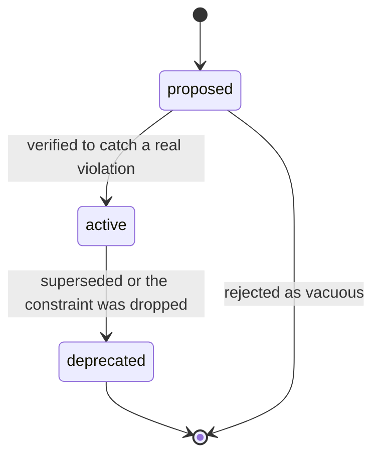
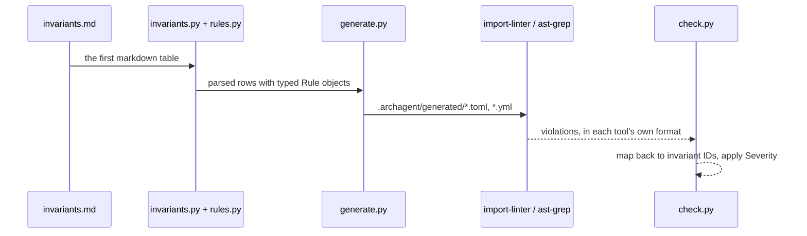

# invariant-pipeline — from a markdown table to a pass/fail report

**Covers:** `src/archagent/invariants.py`, `src/archagent/rules.py`, `src/archagent/generate.py`, `src/archagent/check.py`
**Tier:** domain
**Connects:** config via import

## Purpose

The enforcement half of the tool. A team writes rules in one markdown table; this subsystem compiles them
into configuration for checkers that already exist, runs those checkers, and maps their output back to the
rule that failed.

## Topology and components

A four-stage pipeline, one module per stage:

| Module | Job |
|---|---|
| `invariants.py` | parse the first markdown table in `invariants.md` into rows |
| `rules.py` | parse the `Rule` cell's compact DSL (`forbid a -> b`, `forbid-pattern <p> [in\|outside <scope>]`) |
| `generate.py` | emit `.archagent/generated/` configs for import-linter, dependency-cruiser, ast-grep |
| `check.py` | run each checker, map results back to invariant IDs, decide pass/warn/fail |

## One rule, end to end

Everything below is easier to read against a real example. This is BND-001, the first row of this repo's
own `invariants.md`, at each stage of the pipeline.

**1. What a person writes** — one row in the table, and nothing else:

| ID | Type | Tier | Applies-to | Rule | Severity | Why | Status |
|----|------|------|-----------|------|----------|-----|--------|
| BND-001 | BOUNDARY | structural | python | `forbid archagent.evaluate -> archagent.cli` | error | [0001](../decisions/0001-cli-is-the-only-output-layer.md) | active |

**2. What `rules.py` makes of the `Rule` cell.** `forbid a -> b` is the whole BOUNDARY grammar: a source
module, an arrow, one or more forbidden targets. It becomes a typed object naming `archagent.evaluate` as
the source and `archagent.cli` as forbidden.

**3. What `generate.py` emits** into `.archagent/generated/.importlinter` — an import-linter contract,
named after the ID so the result can be traced back:

```ini
[importlinter:contract:bnd-001]
name = BND-001
type = forbidden
allow_indirect_imports = True
source_modules =
    archagent.evaluate
forbidden_modules =
    archagent.cli
```

**4. What `check.py` does with the result.** import-linter reports a broken contract by *its* name;
`check.py` maps that back to `BND-001`, applies the row's `Severity` of `error`, and fails the run. The
`Why` column is what turns the failure into something actionable — the reader is sent to ADR 0001, which
explains that `cli` is the only output layer, rather than being told an import is forbidden for no
visible reason.

Adding `from .cli import console` to `evaluate.py` to print a progress bar is the commit this rejects.

## Key abstractions

**Compile, do not reimplement.** archagent never analyses imports itself; it writes an import-linter
contract and reads the result (`generate.py`). Adding a language is adding a column to the capability
matrix, not writing an analyser.

**The table is the single source of truth.** Generated configs are derived and gitignored, regenerated on
every `check`. Editing one by hand is pointless by construction — which is the property the tool's own
scattered-source-of-truth check exists to protect elsewhere.

**A rule nothing can compile is still a row.** `prose`-tier rows are parsed and carried but never
generated or run, so a rule stays documented and greppable while it waits for a checker. That creates the
ambiguity two optional columns close: **`Verification`** names the test, command or audit that confirms
the rule — `none` is a legitimate answer, and a more useful one than a blank — and **`Graduation path`**
says what would make it mechanical, or that nothing would. Without them, "archagent cannot generate a
checker for this" and "nobody checks this at all" are the same empty cell. `invariants.py` exposes the
distinction as `is_prose` and `unverified` rather than leaving it to a reader to infer from two blanks.

**A scoped rule must scope to something, and one silently did not.** `_scope_to_globs` turns
`forbid-pattern print($$$) in dspy` into ast-grep globs by joining the scope to each source path. With
`source_paths = ["."]` — a package at the repository root — that produced `./dspy/**`, and **ast-grep
ignores any glob with a `./` prefix**. Measured on dspy at `4ed377ee9`: 0 of 154 `print(` sites matched,
and `check` reported PASS.

A scoped structural rule that enforces nothing while reporting a pass is the exact failure this tool
exists to prevent, arriving through its own code generator. The generated globs are now normalised, and
two tests pin both layouts.

**Everything that could not run is reported as skipped, never as passing.** The failure this guards
against is not a wrong answer but a clean one: when the ast-grep JSON failed to parse, the branch handling
it returned `passed=True` for every invariant it touched, and the report was indistinguishable from a run
where all the rules genuinely held. `check.py` also strips ANSI escapes from every tool's output and asks
the subprocesses not to colourise in the first place, because a checker that decides it is talking to a
terminal returns text a pattern no longer matches — and a pattern that matches nothing reports no
violations, which again reads as a pass.

## State and tiering

`invariants.md` in the artifact (durable, authored). `.archagent/generated/` (derived, disposable).

## Lifecycles


_An invariant's `Status` column. The transition that matters is `proposed -> active`: a rule is only
promoted once a `check` run shows it fails on a real violation, which is what keeps vacuous rules —
those that cannot fail — out of the table._

## Key flows


_One table becomes several tools' configs and their output is folded back to per-invariant results. The
mapping step is why a failure names `BND-001` rather than an import-linter contract number._

## Invariants

Rules in this repo's own table are enforced by this subsystem — it checks itself.
