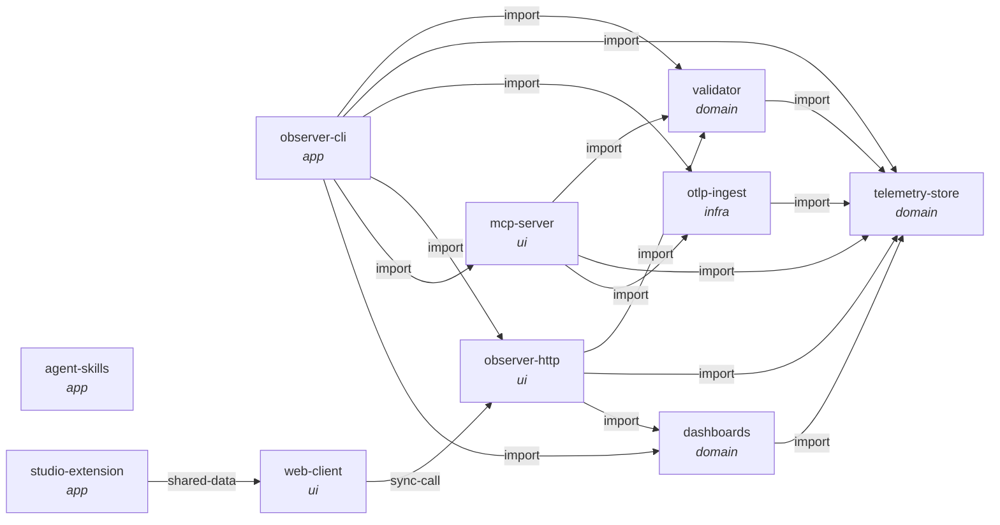

# Architecture Index

Observability Studio is a **local** OpenTelemetry workspace. A developer points their service's OTLP
exporter at an Observer process running on their own machine, and sees the resulting traces, metrics and
logs — assessed for semantic-convention conformance — in a UI inside their editor. Agent skills sit
alongside to audit, add and verify the instrumentation that produces it. Nothing leaves the machine unless
Splunk export is explicitly configured.

**Read `constitution.md` first.** It states the layering every other document assumes, and — importantly —
what this artifact's tooling can and cannot check, because the core of the system is Go and archagent does
not analyse Go. Then `subsystems/telemetry-store.md`, which everything else depends on, and
`subsystems/observer-http.md`, which is where the interesting duplication lives.

**ADRs and invariants are different things.** An ADR in `decisions/` is prose recording *why* the
structure is as it is and binds nobody. A row in `invariants.md` is a rule with a checker behind it, run
by `archagent check`. In this repository **almost every architectural rule is prose**, because the rules
worth enforcing are about Go and nothing here can enforce them — `invariants.md` says so per row rather
than leaving the reader to assume the table is complete.

## System map

<!-- archagent:graph -->

<!-- /archagent:graph -->

## Documents

| Document | What it holds |
|---|---|
| `constitution.md` | the layering, the in-memory model, and the tooling's blind spot |
| `invariants.md` | the rules, almost all of them `prose` tier and why |
| `deployment.md` | how it runs (one binary plus an editor extension) and what it configures |
| `subsystems/telemetry-store.md` | the in-memory ring buffers everything reads |
| `subsystems/otlp-ingest.md` | receiving OTLP, and optional Splunk forwarding |
| `subsystems/validator.md` | running `weaver` over stored telemetry |
| `subsystems/observer-http.md` | REST, the WebSocket, and the served UI |
| `subsystems/mcp-server.md` | the same telemetry, addressed to an agent |
| `subsystems/dashboards.md` | previewing Splunk dashboard specs locally |
| `subsystems/observer-cli.md` | the composition root and the installer |
| `subsystems/web-client.md` | the React UI |
| `subsystems/studio-extension.md` | the editor extension that hosts it |
| `subsystems/agent-skills.md` | the shipped agent instructions |
| `decisions/` | ADRs |

## Coverage

84 of 84 Python and TypeScript source files are claimed by a subsystem document. The 64 Go files under
`observer/` are described in the subsystem documents and declared in their `**Covers:**` lines, but
archagent counts none of them — see `constitution.md`.

This artifact was generated at commit `88aebe8` and describes the product only: `pytest-codex-evals/`,
`evals/` and `examples/` are test scaffolding and are deliberately out of scope.
