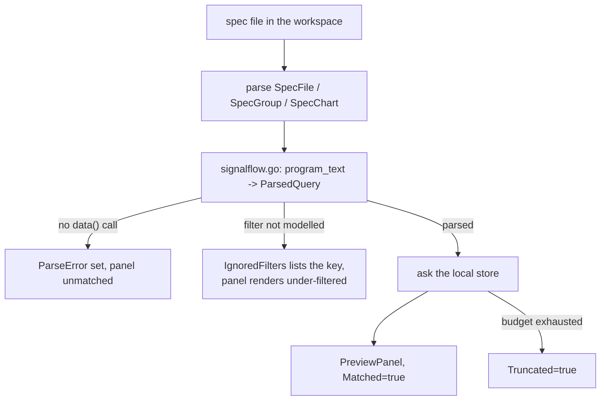

# dashboards — previewing Splunk dashboard specs before they are published

**Covers:** `observer/internal/dashboards/*.go`
**Tier:** domain
**Connects:** telemetry-store via import

## Purpose

Reads a dashboard spec from the developer's workspace, parses the SignalFlow queries inside it, and
renders a preview against the telemetry currently in the local store — so a chart can be checked before
the spec is pushed to Splunk Observability Cloud.

This is the local half of the `$splunk-dashboard-publish` skill: the skill generates and publishes
Terraform, this package answers "would that chart show anything, given what my service is emitting right
now?"

## Topology and components

| File | Job |
|---|---|
| `model.go` | the spec and preview types — `SpecFile` → `SpecGroup` → `SpecDashboard` → `SpecChart` |
| `signalflow.go` | parse a SignalFlow query into a `ParsedQuery` the store can be asked about |
| `preview.go` | `Resolver` (`:64`) — locate the spec, resolve each chart against the store |

Two parallel type families, deliberately: `Spec*` is what the developer wrote, `Preview*` is what it
resolves to. Keeping them apart is why an unresolvable chart can be reported as an empty panel with a
reason rather than by dropping it.

## Key abstractions

**The spec lives in the workspace, not in the Observer.** `Config` (`preview.go:51`) carries
`WorkspaceRoot` and `SpecPath`, both passed in by `cmd` from `OBSTUDIO_WORKSPACE_ROOT` and
`OBSTUDIO_DASHBOARDS_PREVIEW` (`main.go:158-160`). The Observer never owns the spec; it reads whatever the
editor points it at.

**SignalFlow is parsed, not executed.** `signalflow.go` extracts enough of a query — metric name,
filters, aggregation, percentile — to ask the local store an equivalent question (`ParsedQuery`,
`model.go:109-116`). It is not a SignalFlow interpreter.

**Three separate ways of admitting the preview is incomplete, and they are kept distinct.** This is the
most carefully built part of the package:

| Field | Says |
|---|---|
| `ParsedQuery.ParseError` | the query could not be read at all — e.g. `"no data('<metric>') call found in program_text"` (`signalflow.go:277`) |
| `ParsedQuery.IgnoredFilters` | the query was read, but *these named constraints* could not be applied, so the panel is under-filtered |
| `PreviewPanel.Truncated` | the data was cut by the response-size budget rather than absent |

`IgnoredFilters` is the interesting one: rather than failing the panel or silently showing wrong data, it
shows the data and names the constraints it could not honour. A developer can see that a chart is broader
than their spec asked for, and which filter caused it.

## State and tiering

Stateless. Reads the filesystem for the spec and the store for data.

## Key flows

_**What to notice:** an empty chart has three different causes here, and the code refuses to let them
collapse into one. The comment on `Truncated` (`model.go:92-98`) says it outright — budget-limited and
"No data in window" **"look identical when DataPoints is empty"**, so a flag exists purely to tell them
apart. That is the same principle the validator applies to failed runs: a tool that cannot answer must not
render as a tool that answered "nothing wrong". It is worth noticing that this repo arrived at it
independently in two subsystems._

## Invariants

- DASH-001 (proposed) — an unparseable chart must not fail the whole preview, and "no data", "filtered
  differently than you asked" and "cut by the budget" must remain distinguishable. Supported by
  `ParseError`, `IgnoredFilters` and `Truncated` (`model.go:98`, `:115`); not mechanically checked.
