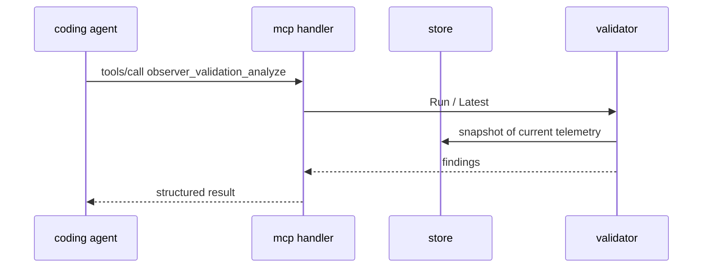

# mcp-server — the same telemetry, addressed to an agent

**Covers:** `observer/internal/mcp/*.go`
**Tier:** ui
**Connects:** telemetry-store via import, validator via import, otlp-ingest via import

## Purpose

Exposes the Observer over the Model Context Protocol so a coding agent can ask about the telemetry the
developer is looking at. Same data as the UI, different consumer.

## Topology and components

| File | Job |
|---|---|
| `handler.go` | the tool definitions and their implementations |
| `http.go` | MCP over HTTP, mounted on the shared mux by `Register` |
| `stdio.go` | MCP over stdin/stdout, run as a goroutine by `cmd` (`main.go:191`) |

**Two transports, one handler.** The Observer serves MCP over HTTP *and* over stdio simultaneously,
because agents differ: some connect to a URL, some spawn a subprocess and speak over pipes. Both call the
same tool implementations.

## Key abstractions

**The tools mirror the UI's tabs, plus the things only an agent needs.** `observer_traces_overview`,
`observer_metrics_overview`, `observer_logs_overview`, `observer_trace_detail`, `observer_metric_detail`
(`handler.go:354-427`) are the read surface. `observer_validation_status`, `_analyze`, `_refresh`
(`:428-476`) expose the validator. `observer_clear` and `observer_status` (`:477-495`) are control.

**Splunk export tools are registered conditionally.** `observer_splunk_metrics_export_status`,
`_configure` and `_test` (`:496-523`) sit inside a conditional — an agent connecting to an Observer with
no Splunk configuration does not see tools it cannot use. Compare the UI, which renders the same
capability as a disabled control.

**This is the only outward interface that can change state beyond validation.** `observer_clear` wipes
the store. There is no equivalent `POST /api/clear` in the REST surface.

## State and tiering

None of its own.

## Key flows

_**What to notice:** the agent reaches the validator through the same `Service` the REST API uses, so an
agent and the UI cannot disagree about whether telemetry is conformant. Contrast the trace read path,
where the WebSocket and REST **do** duplicate logic (`observer-http.md`) — here the reuse is real._

## Invariants

- MCP-001 (proposed) — HTTP and stdio transports must expose the same tool set. Structurally true at
  `88aebe8` (both dispatch into `handler.go`); not mechanically checked.
