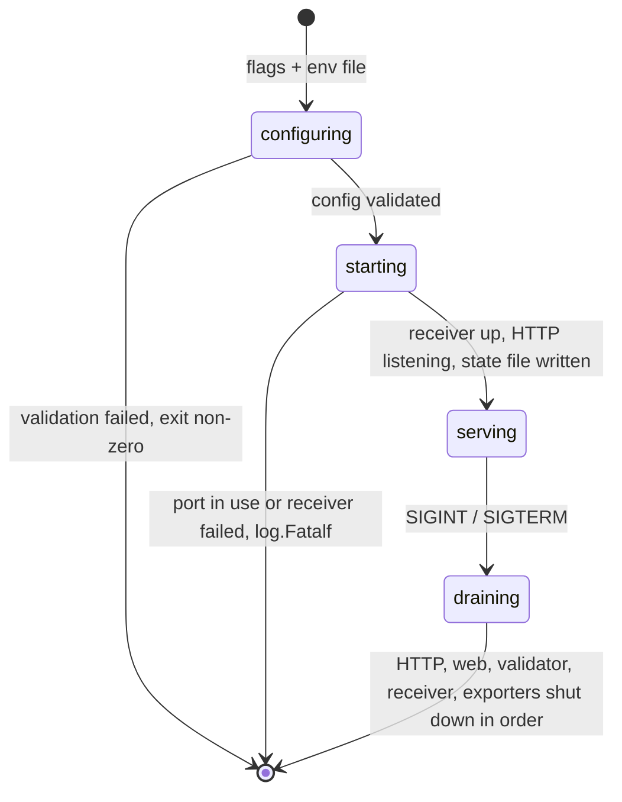

# observer-cli — the composition root, and the installer

**Covers:** `observer/cmd/obstudio/*.go`, `observer/internal/buildutil/*.go`
**Tier:** app
**Connects:** telemetry-store via import, validator via import, otlp-ingest via import, observer-http via import, mcp-server via import, dashboards via import

## Purpose

The `obstudio` binary. Two commands: the default one runs the Observer, and `obstudio install` writes the
agent skills and MCP configuration into whichever coding agents the developer names.

## Topology and components

| File | Job |
|---|---|
| `main.go` | flags, environment resolution, and `run()` — the composition root |
| `install.go` | the per-agent install matrix and MCP config writing |
| `embed.go` | the skills and UI bundle embedded into the binary |
| `internal/buildutil/stage_skills.go` | build-time staging of `skills/` into the embed tree |

**`run()` (`main.go:73-204`) is the only place anything is wired to anything.** It constructs the store,
the validator store and manager, registers the two callbacks, resolves Splunk configuration from the
environment, starts the OTLP receiver, mounts `api`, `mcp` and `web` on one `ServeMux`, starts the HTTP
server, launches MCP-over-stdio, then blocks on SIGINT/SIGTERM and shuts everything down in order.

Every dependency in the system is passed as a parameter from this function. No package below it constructs
another package's types.

## Key abstractions

**Agents are a data table, not a code path.** `targets` (`install.go:76`) maps each agent name to where
its skills live and how its MCP config is written:

| Target | Skills directory | MCP config |
|---|---|---|
| `cursor` | `~/.cursor/skills/obstudio` | `~/.cursor/mcp.json` (JSON) |
| `claude-code` | `~/.claude/skills/obstudio` | `~/.claude.json` (JSON) |
| `codex` | `~/.codex/skills/obstudio` | `~/.codex/config.toml` (TOML) |
| `kiro` | `~/.kiro/skills/obstudio` | `~/.kiro/settings/mcp.json` (JSON) |

Adding an agent is adding a row. The one real variation — Codex uses TOML where the others use JSON — is
carried as a `format` field rather than a branch.

**A shared config file is edited between markers, never rewritten.** `codexManagedBlockStart` /
`codexManagedBlockEnd` (`install.go:29-30`) delimit the region `obstudio` owns inside a file the developer
also edits. Installing twice replaces the block; it does not duplicate it or clobber the user's own
servers.

**A running Observer advertises itself on disk.** `sharedObserverState` (`install.go:68`) — base URL,
health URL, MCP URL, PID — is written at startup (`main.go:173`) and cleared at shutdown, *only if this
process still owns it* (`clearSharedObserverStateIfOwned`, `main.go:177`). That ownership check is what
stops a second Observer's exit from deleting the first one's state.

## State and tiering

The shared observer state file, and whatever `install` writes into the user's home directory. Both
outside the repo.

## Lifecycles

_The process lifecycle. **What to notice:** startup failures use `log.Fatalf` and exit, but a validator
that fails to start only logs (`main.go:99-101`). That asymmetry is deliberate and correct — telemetry
capture is the product, assessment is an enhancement, so a missing `weaver` binary must degrade the tool
rather than prevent it from running._

## Invariants

- CLI-001 (proposed) — only `cmd` may construct another package's types. True at `88aebe8`; not
  mechanically checked, and the rule most likely to erode as the system grows.
- CLI-002 (proposed) — shutdown must release the shared state file only if this process owns it
  (`main.go:177`).
