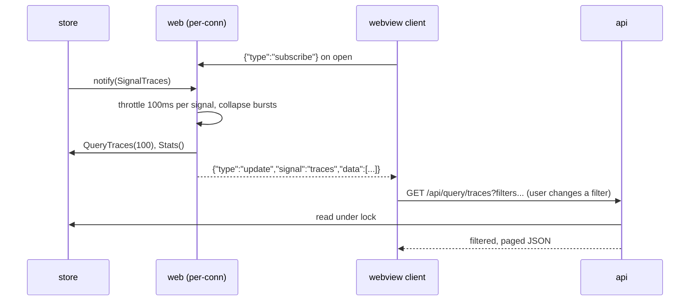

# observer-http — the REST API, the WebSocket, and the UI it serves

**Covers:** `observer/internal/api/*.go`, `observer/internal/web/*.go`
**Tier:** ui
**Connects:** telemetry-store via import, validator via import, dashboards via import

## Purpose

Everything the Observer exposes over its one HTTP port: a read-mostly REST API for queries, a WebSocket
that pushes change notifications, and the compiled React UI served as static files.

Two packages because the concerns differ. `api` answers questions; `web` pushes events and serves the
bundle.

## Topology and components

**`api.Register(mux, store, ...)`** (`api/handler.go:40`) mounts ~19 routes on the shared `ServeMux`.
They divide cleanly:

| Shape | Routes |
|---|---|
| `GET /api/query/...` | traces, metrics, logs, stats, and a `filter-values` sibling for each |
| `GET /api/query/validation/...` | summary, status, latest, findings |
| `POST /api/validation/...` | run, refresh, analyze — the only state-changing routes |
| `GET /api/health`, `GET /api/dashboards/preview` | service info; dashboard spec preview |

**Every query route has a `filter-values` twin** (`:77`, `:80`, `:82`). The UI populates a filter dropdown
from the data actually present rather than from a fixed list, so a developer only ever sees service names
and attribute keys their own telemetry produced.

**`web.Register(mux, store, validator)`** (`web/server.go:16`) does three things and returns a cleanup
function: mounts `GET /api/ws`, subscribes to both stores and fans their signals out to connected
sockets, and serves the embedded SPA with an `index.html` fallback for unmatched paths.

## Key abstractions

**The WebSocket pushes data, not just a notification.** `queryAndSend` (`web/websocket.go:204-221`)
reads the store itself and sends `{type:"update", signal, data}` — `QueryTraces(100)`, `QueryMetrics(100)`,
`QueryLogs(100)`, `Stats()`, or the validator snapshot. The client's `ServerMessage`
(`client/src/telemetry/useTelemetry.ts:32-36`) matches that shape.

**This means there are two independent read paths for the same telemetry**, and they do not share code:
`GET /api/query/traces` in `api/handler.go:76`, and `QueryTraces(100)` on the socket. The REST route takes
filters and paging from the query string; the socket path hardcodes a limit of 100 and takes no filters.
They can disagree, and nothing would catch it — a filter added to one is not added to the other. This is
the single most likely place for this system to drift, and it is recorded here rather than smoothed over.

**The socket is bidirectional and has a pause mode.** The client sends `{type:"subscribe"}` on open and
`{type:"pause"}` to stop the firehose (`useTelemetry.ts:200-204`). While paused, only `validation` is
still delivered; everything else collapses into one `paused-update` message sent once, so a paused UI
shows a "stale" badge rather than silently freezing.

**Pushes are throttled per signal, not per message.** `throttledPush` (`web/websocket.go:260`) starts a
100 ms timer (`:16`) per signal and sets a `pending` flag if another arrives inside it, collapsing a burst
into one push per interval per signal. A service emitting thousands of spans a second therefore produces
ten UI updates a second, not thousands.

**Any non-validation signal also pushes `stats`** (`websocket.go:233-236`), because the header counters
change whenever any telemetry arrives.

**Cleanup is returned, not registered.** `Register` hands back a closure that unsubscribes both
subscriptions, and `cmd` holds it from `main.go:163` and calls it at shutdown (`:201`). The package that created the
subscriptions owns undoing them.

**Static assets are deliberately not cached; `index.html` is.** `/assets/` is served with
`Cache-Control: max-age=0, must-revalidate` (`web/server.go:41`, comment at `:39-40`) and the comment says why: asset names
are content-stable, so a webview upgrading the extension would otherwise pin stale JS across versions.
This is a real bug someone hit, fixed in one line, and worth not re-litigating.

## State and tiering

No state of its own. Two subscriptions, released by the returned cleanup.

## Key flows

_**What to notice:** both arrows into `store` are reads of the same telemetry through **different code**.
The socket path is fixed at 100 records and no filters; the REST path takes the user's filters and paging.
The socket serves the live tail, REST serves interrogation — a reasonable split, but the duplication is
real: a change to how traces are selected has to be made twice, and nothing in the build would notice if
it were made once._

## Invariants

- HTTP-001 (proposed) — only `POST /api/validation/*` changes state; every `/api/query/*` route is a
  read. True at `88aebe8` (`api/handler.go:75-92`); not mechanically checked.
- HTTP-002 (proposed) — the WebSocket and REST read paths must agree on how records are selected. They
  currently do not share code (`web/websocket.go:204-218` vs `api/handler.go:76-84`). This is a finding,
  not a satisfied rule, and it is written down so it stops being invisible.
