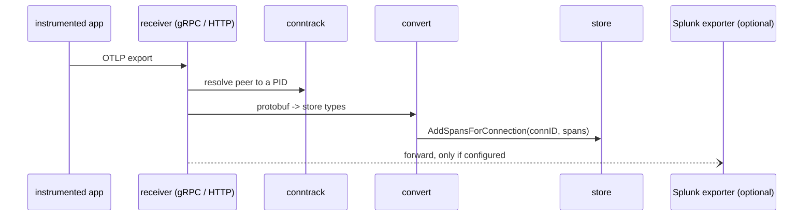

# otlp-ingest — receiving telemetry, and optionally forwarding it

**Covers:** `observer/internal/otlp/*.go`
**Tier:** infra
**Connects:** telemetry-store via import

## Purpose

Accepts OTLP over both gRPC and HTTP, converts the wire format into the store's own types, records which
process sent it, and — when Splunk export is configured — forwards metrics and traces onward.

## Topology and components

| File | Job |
|---|---|
| `receiver.go` | start the gRPC and HTTP listeners; `StartReceiver` (`:91`) is the entry point |
| `httphandler.go` | the OTLP/HTTP path |
| `convert.go` | OTLP protobuf → `store.Span` / `MetricDataPoint` / `LogRecord` |
| `conntrack.go` | map an incoming connection to the process that opened it |
| `pidresolver_unix.go`, `pidresolver_windows.go`, `pidresolver_common.go` | per-OS process lookup behind one interface |
| `splunk_exporter.go`, `splunk_traces_exporter.go` | optional forwarding to Splunk Observability Cloud |

## Key abstractions

**Export is an interface the receiver may or may not be given.** `MetricsExporter`
(`splunk_exporter.go:30`) and `TracesExporter` (`splunk_traces_exporter.go:29`) are passed as functional
options — `otlp.WithMetricsExporter(metricsExporter)` at `main.go:142`. When Splunk is not configured
`cmd` passes a nil exporter rather than a no-op one, so the forwarding path is absent instead of running
and discarding.

**Connection tracking is why the UI can attribute telemetry to a process.** `conntrack.go` resolves the
peer of an OTLP connection to a PID, and the store stamps records with the connection id
(`store.go:448`). Without this, a developer running two services against one Observer would see one
undifferentiated stream.

**Per-OS code sits behind build-tagged files, not conditionals.** `pidresolver_unix.go` and
`pidresolver_windows.go` implement the same contract, and `pidresolver_common.go` holds what they share.
Nothing above this package knows the OS differs.

## State and tiering

Stateless apart from the connection table. Everything durable goes to `store`.

## Key flows

_**What to notice:** the store write comes first and the forward is asynchronous —
`s.AddSpansForConnection(...)` then `exportTracesAsync(...)` at `receiver.go:134-135`, and the same pair
for metrics at `:142-143`. Telemetry therefore reaches the local store before export is attempted, and a
Splunk endpoint that is slow, unreachable or misconfigured cannot block or fail local ingest. A broken
token degrades forwarding without touching the local workspace, which is the whole product._

## Invariants

- OTLP-001 (proposed) — a Splunk export failure must not prevent local ingest. Holds at `88aebe8` by
  construction (export is a separate path off the receiver); not mechanically checked.
