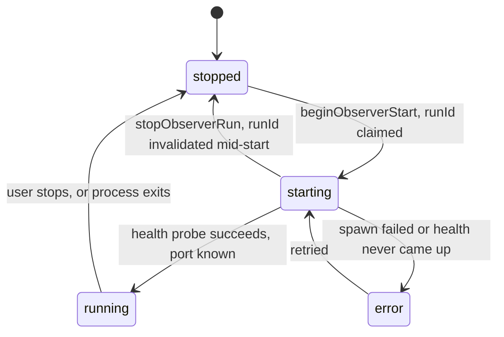

# studio-extension — running the Observer inside an editor

**Covers:** `extension/src/**/*.ts`
**Tier:** app
**Connects:** web-client via shared-data

## Purpose

A VS Code-compatible extension (VS Code, Kiro, Cursor) that starts the Observer as a child process, waits
for it to become healthy, and shows its UI in a webview. It is what turns a CLI into something a developer
never has to think about.

## Topology and components

| File | Lines | Job |
|---|---|---|
| `extension.ts` | 1506 | activation, commands, webview lifecycle, wiring |
| `webview-html.ts` | 252 | the HTML shell that loads the client bundle into a webview |
| `observer-lifecycle.ts` | 114 | the start/stop state machine |
| `startup-errors.ts` | 159 | turn a process failure into a message with a suggested fix |
| `backend.ts` | 129 | how to invoke the Observer, and how to recognise a healthy one |

**`extension.ts` is 1506 lines — an order of magnitude larger than anything beside it**, and it is the
one place in this system where a document should say so plainly. Activation, command registration,
webview management and lifecycle wiring all live in it. The three smaller modules were pulled out of it
(each is pure and separately tested); the remainder has not been.

## Key abstractions

**A run id makes stale startups harmless.** `ObserverLifecycleState` (`observer-lifecycle.ts:3`) carries
`currentRunId` and `activeRunId`. `beginObserverStart` (`:30`) increments and claims the id;
`stopObserverRun` (`:43`) increments it *without* claiming, so any in-flight startup that completes
afterwards finds its id no longer active and aborts with `ObserverLifecycleCancelledError` (`:12`). A user
who toggles the Observer off and on twice in a second cannot end up with two processes or a webview bound
to the dead one.

**Startup errors carry a hint, not just a message.** `startupError` and `startupHint` are separate fields
on the state. A port conflict and a missing binary produce different suggested actions, and the webview
shows both.

**The extension discovers an already-running Observer rather than assuming ownership.** `backend.ts`
reads the `SharedObserverState` file that `observer-cli` writes (`install.go:68`) and probes
`ObserverHealth`. A developer who started `obstudio` in a terminal gets the extension attaching to it
instead of a second process fighting for the port.

## State and tiering

`ObserverLifecycleState` in memory, the child process handle, and the webview panel. Everything durable
belongs to the Observer.

## Lifecycles

_The four states of `ObserverLifecycleStatus` (`observer-lifecycle.ts:1`). **What to notice:** the
`starting -> stopped` edge is the one that carries the design. It is not "startup failed" — that is
`error` — it is a startup **abandoned** because the user changed their mind while it was in flight. Both
end at `stopped`, but only one should surface a message, which is exactly why a cancelled run raises a
distinct `ObserverLifecycleCancelledError` rather than a generic failure._

## Invariants

- EXT-001 (proposed) — a completing startup must verify it still owns the active run id before binding
  the webview (`observer-lifecycle.ts:30-48`).
- EXT-002 (proposed) — `extension.ts` should not keep absorbing new responsibility. Not expressible as a
  rule; recorded as a size observation.
