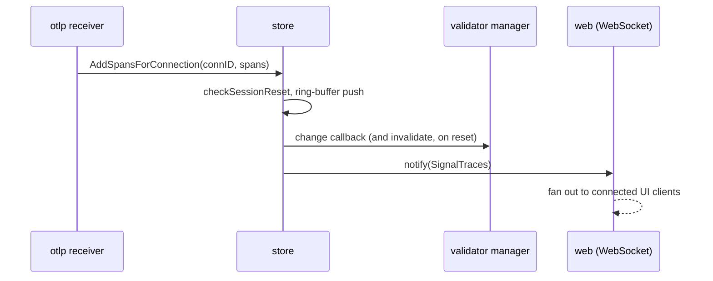

# telemetry-store — the in-memory telemetry the whole system reads

**Covers:** `observer/internal/store/*.go`
**Tier:** domain

## Purpose

Holds every span, metric data point and log record the Observer has received, in memory, and answers
queries about them. It is the leaf of the Go dependency graph: it imports no other `internal/` package,
and every other package imports it.

## Topology and components

`store.go` (the buffers, the query types and the filters) and `genai.go` (a derived view that groups
GenAI spans into an agent-flow graph). `Store` is a single struct behind one `sync.Mutex`.

Storage is three generic ring buffers (`store.go:314-316`):

```go
spans   ringBuffer[Span]
metrics ringBuffer[MetricDataPoint]
logs    ringBuffer[LogRecord]
```

`ringBuffer[T]` (`store.go:338`) has a fixed capacity and `push` overwrites the oldest entries. **Telemetry
loss is a designed behaviour, not a failure.** The tool covers the minutes in which a developer is
iterating on instrumentation; a restart drops everything and a long run drops the oldest records. The UI
comments on this directly — `logs/LogsTab.tsx:220` reasons about records vanishing "after store clear,
WebSocket reconnect, or eviction from the buffer".

## Key abstractions

**Records are tagged with the connection that produced them.** `AddSpansForConnection(connID, spans)`
(`store.go:443`) stamps `ownerConnID` on each record so telemetry can later be evicted per OTLP
connection rather than only wholesale. This is what lets one restarted service clear its own data without
disturbing another's.

**The store pushes, it does not get polled.** Two callbacks are registered by `cmd` at startup
(`main.go:79-80`): `SetInvalidateCallback` and `SetChangeCallback`, both wired to the validator's manager.
Adding telemetry therefore invalidates assessment automatically. Nothing has to remember to do it.

**A session reset is detected, not announced.** `checkSessionReset()` runs inside every add, and when it
fires the store notifies on all three signals rather than just the one being written. A service that
restarts and begins a new session must not leave the UI showing a mixture of two runs.

## State and tiering

All state, and the only state in the Observer. Bounded, volatile, mutex-guarded.

## Key flows



_Ingest is the only writer, and one write drives three consumers without the receiver knowing any of them
exist. **What to notice:** the callbacks are set by `cmd` and not by the store, which is why `store` can
sit at the bottom of the graph while still driving the validator above it — the dependency points down,
the notification travels up through a function pointer._

## Invariants

- STORE-001 (proposed) — `store` must import no other `internal/` package. True at `88aebe8`; nothing
  enforces it, because archagent does not analyse Go.
- Reading `MAX_FLOW_NODE_SPAN_LIST_SIZE` at `genai.go:1338` contradicts the configuration pattern in
  `constitution.md`. Recorded there and in `invariants.md`.
