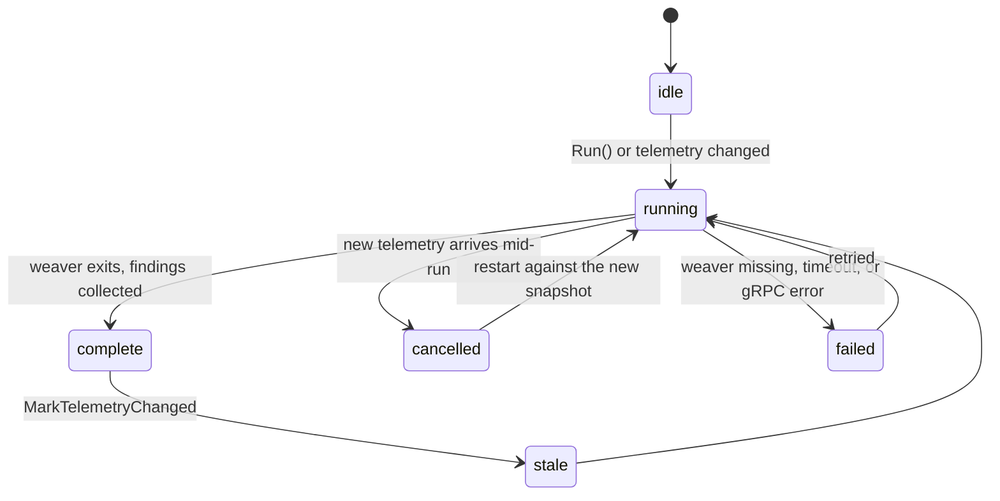

# validator — is this telemetry actually conformant?

**Covers:** `observer/internal/validator/*.go`
**Tier:** domain
**Connects:** telemetry-store via import

## Purpose

Runs OpenTelemetry's `weaver` against the telemetry currently in the store and turns its output into
findings the UI and the MCP server can present — "this span sets `http.method`, which was renamed to
`http.request.method`", and similar semantic-convention violations.

This is the part that makes the product more than a telemetry viewer.

## Topology and components

| File | Job |
|---|---|
| `manager.go` | owns the lifecycle of a validation run: schedule, cancel, collect, enrich |
| `service.go` | the query surface — `Summary()`, `Latest(q)`, `Findings(q, runID)` |
| `normalize.go` | reconcile weaver's shapes with the store's |
| `export.go` | push a telemetry snapshot into weaver over gRPC |
| `model.go`-adjacent types | `Finding`, `Entity`, `Snapshot`, `Summary` |

**`weaver` is an external binary, not a library.** `runWeaverSnapshot` (`manager.go:210`) spawns it,
streams a telemetry snapshot to it over gRPC (`exportSnapshot`, `:283`), and parses its stdout. That is
the single largest external dependency in the system and the reason the validator has a health timeout, a
cancellation path and a stderr collector where nothing else does.

## Key abstractions

**A run is cancellable and only one runs at a time.** `setActiveRun` / `cancelActiveRun`
(`manager.go:133-160`) hold a single active run and its `context.CancelFunc`. New telemetry arriving
mid-run cancels it rather than queueing a second — the result would describe a snapshot that no longer
exists.

**Freshness is a first-class concept, not a timestamp comparison at the call site.** `FreshnessMode`
(`service.go:14`) lets a caller say whether a stale assessment is acceptable. The store's change callback
(`MarkTelemetryChanged`, `manager.go:68`) is what makes an assessment stale, and it is wired in by `cmd`
rather than observed by the validator.

**Errors are classified, not just returned.** `ServiceErrorKind` (`service.go:22`) distinguishes kinds of
failure so the UI can say "weaver is not installed" rather than "validation failed". A validator that
cannot run and a validator that ran and found nothing must never look the same to a user — the same
distinction archagent itself records as ADR 0002.

## State and tiering

Its own `validator.Store` of runs and findings, separate from the telemetry store. Both are in memory.

## Lifecycles

_A validation run's life. **What to notice:** `complete -> stale` and `running -> cancelled` are both
driven by the *store*, not by a timer or a user action. Assessment is a function of the telemetry present
right now, so anything that changes the telemetry invalidates the answer — and `failed` is kept distinct
from `complete` with no findings, because "weaver is not installed" must not render as "your
instrumentation is clean"._

## Invariants

- VAL-001 (proposed) — a failed run must be reported as failed, never as an empty result. Supported by
  `ServiceErrorKind` (`service.go:22`); not mechanically checked.
- Reads `WEAVER_PATH` and `OBSTUDIO_VALIDATOR_HEALTH_TIMEOUT` directly (`manager.go:509`, `:553`),
  against the configuration pattern in `constitution.md`.
