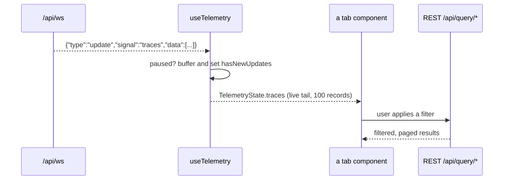

# web-client — the React UI the Observer serves

**Covers:** `observer/client/src/**/*.ts`, `observer/client/src/**/*.tsx`
**Tier:** ui
**Connects:** observer-http via sync-call

## Purpose

The single-page app a developer actually looks at: live traces, metrics and logs from their own service,
with validation findings alongside. Built into static assets, embedded into the Go binary, and served by
`observer-http`.

## Topology and components

One tab per telemetry signal, plus validation and dashboards:

| Directory | Tab / concern |
|---|---|
| `traces/` | trace list, waterfall, span details, and a GenAI-specific overview |
| `metrics/` | metric list and time-series charts |
| `logs/` | log list with filtering |
| `services/` | per-service rollup |
| `validation/` | validator findings |
| `dashboards/` | Splunk dashboard spec preview |
| `telemetry/` | `useTelemetry` — the WebSocket connection every tab reads from |
| `api/` | `client.ts` (REST) and `types.ts` (the shared wire types) |
| `layout/`, `components/`, `hooks/` | shell, shared widgets, keyboard shortcuts |

## Key abstractions

**One WebSocket, one hook, every tab.** `useTelemetry` (`telemetry/useTelemetry.ts:167`) owns the single
connection to `/api/ws` (`:194`) and exposes a `TelemetryState` holding all five signals at once
(`:5-12`). Tabs read from it; none of them opens its own socket or manages reconnection.

**Pause is a client concern that the server participates in.** `TelemetryHandle` (`:15-30`) offers
`pause`, `resume`, `toggle`, `flush` and — the interesting one — `hasNewUpdates`. Pausing sends
`{type:"pause"}` to the server, which stops pushing telemetry but keeps delivering validation
(`web/websocket.go:238-243`). The client buffers what arrives and `hasNewUpdates` drives the "new data"
badge, so a developer reading a stack trace is never yanked away from it but always knows more has landed.

`flush` applying buffered updates *without* resuming is the detail worth noticing: it exists because
"show me the latest" and "go back to live" are different intentions.

**The wire types are declared once and shared.** `api/types.ts` holds `TraceSummary`, `MetricGroup`,
`LogRecord`, `Stats`, `ValidationSnapshot` — the same shapes the Go store serialises. They are
hand-maintained against the Go structs rather than generated, so `store.go`'s JSON tags and this file are
a single source of truth split across two languages with nothing checking they agree.

## State and tiering

All client state is derived from the socket. No local persistence.

## Key flows

_**What to notice:** the tab reads from two sources with different guarantees. The socket gives an
unfiltered tail capped at 100 records; REST gives whatever the user asked for. That is a sound split — but
it means "what the UI shows" is assembled from two server code paths that do not share selection logic
(see `observer-http.md`), and a filter semantics change made in one would not show up in the other._

## Invariants

- WEB-001 (proposed) — exactly one WebSocket connection per client session, owned by `useTelemetry`.
- WEB-002 (proposed) — `api/types.ts` must match the Go JSON tags in `observer/internal/store/store.go`.
  Hand-maintained across a language boundary and unchecked by anything; the most likely silent break in
  the system.
