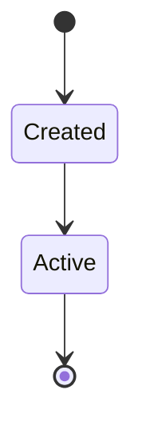
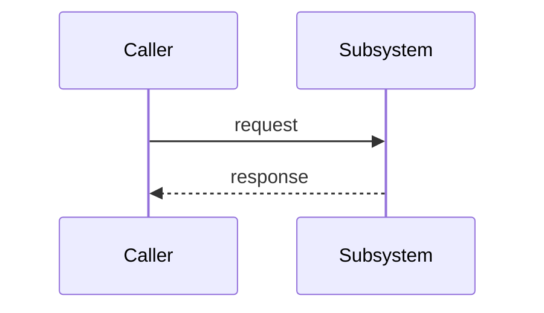

# <Subsystem name>

> **Purpose.** One short paragraph: what this subsystem is for and why it exists.
> A new engineer should understand it here without opening other files.

## Topology & components
What the pieces are and how they connect. Reference real files (`path/to/file.py`).

## Key abstractions & patterns
The few abstractions/patterns this subsystem relies on, each with one concrete example.

## State & tiering
What state lives here, where (in-memory / durable / cache), and how it's scoped.

## Lifecycles

_Caption: one plain-language sentence on what this lifecycle shows and the key takeaway._

## Key flows

_Caption: one plain-language sentence on what this flow shows._

## Invariants
Which rows in [`../invariants.md`](../invariants.md) apply here, and why they matter.
