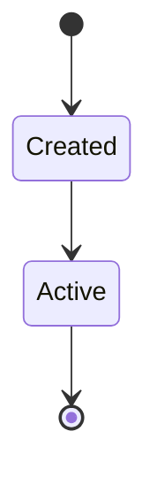
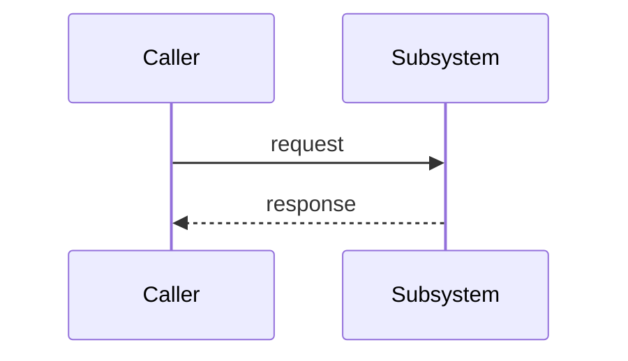

# <Subsystem name>

**Covers:** `src/<area>/**`
<!-- Glob(s) of the code this subsystem owns. `archagent drift` uses this to flag when the code
     changed but this doc didn't. Optional — if omitted, drift falls back to the file refs below. -->

**Connects:** other-subsystem via sync-call, another-subsystem via async-event, a-third
<!-- Other subsystems (by doc name) this one connects to, each optionally typed by connector kind:
     `import` (in-process code dependency — the default if `via <kind>` is omitted), `sync-call` (blocking
     request/response — HTTP/gRPC/RPC), `async-event` (pub/sub, message queue), `shared-data` (both read/
     write a shared store), `pipe` (one-way stream). `archagent drift` checks `import` edges against the
     actual import graph; `archagent evaluate` uses the kinds to tell tight coupling (a synchronous service
     cycle = distributed monolith) from loose (an event-coupled cycle is usually fine). Optional.
     Legacy alias: `**Depends-on:** a, b` == `**Connects:** a via import, b via import`. -->

**Service:** <deployment-service-name>
<!-- The deployment service this subsystem runs as (a name from deployment.md's **Services:**). When set,
     `archagent drift` checks the code's cross-service dependencies against docker-compose depends_on. -->

**Tier:** <ui | domain | infra>
<!-- The architectural layer this subsystem lives in (e.g. ui / app / domain / infra / data). When set on
     related subsystems, `archagent evaluate` flags leaky abstractions: a lower tier depending up on a
     higher one, or a tier reaching past its neighbor to a distant one. Optional. -->

> **Purpose.** One short paragraph: what this subsystem is for and why it exists.
> A new engineer should understand it here without opening other files.

## Topology & components
What the pieces are and how they connect. Reference real files (`path/to/file.py`).

## Key abstractions & patterns
The few abstractions/patterns this subsystem relies on, each with one concrete example.

## State & tiering
What state lives here, where (in-memory / durable / cache), and how it's scoped.

## Lifecycles

_Caption: one plain-language sentence on what this lifecycle shows and the key takeaway._

## Key flows

_Caption: one plain-language sentence on what this flow shows._

## Invariants
Which rows in [`../invariants.md`](../invariants.md) apply here, and why they matter.
