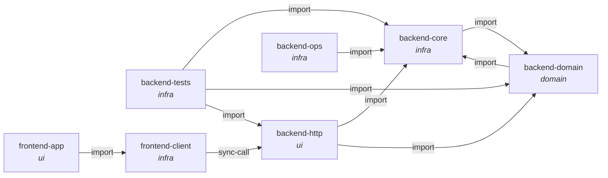

# Architecture Index

A two-service web application template: a **FastAPI** backend over Postgres and a **React** frontend,
both containerised and wired together by `docker-compose.yml` behind a Traefik proxy.

**Read `constitution.md` first.** The one thing that explains most of the design is that the contract
between the two services is *generated* — the frontend's TypeScript client is produced from the backend's
OpenAPI schema by `scripts/generate-client.sh`, so a route change reaches the frontend through a build
step rather than through someone remembering.

Then `subsystems/backend-http.md` for how authorisation works (it is a parameter type, not a decorator),
and `subsystems/backend-core.md` for the one place the layering is deliberately broken.

**ADRs and invariants are different things.** An ADR records *why*; a row in `invariants.md` is a rule
with a checker behind it. Most rows here are `prose` tier — the properties worth enforcing in this
codebase are about dependency-injection shapes and container ordering, which the DSL cannot express, and
`archagent check` reports them as *not checked* rather than as passing.

## System map

<!-- archagent:graph -->

<!-- /archagent:graph -->

## Documents

| Document | What it holds |
|---|---|
| `constitution.md` | the generated contract, the backend layering, and the one exception to it |
| `invariants.md` | the rules, and why almost all of them are prose |
| `deployment.md` | five compose services, the ports, and the configuration |
| `subsystems/backend-http.md` | FastAPI app, routers, the authorisation ladder |
| `subsystems/backend-domain.md` | models, CRUD, email |
| `subsystems/backend-core.md` | config, engine, hashing — and the upward import |
| `subsystems/backend-ops.md` | migrations and start-up ordering |
| `subsystems/backend-tests.md` | the pytest suite and its fixtures |
| `subsystems/frontend-client.md` | the generated SDK |
| `subsystems/frontend-app.md` | routes, components, forms |

## Coverage

13 backend Python files (excluding Alembic versions) and 76 frontend TypeScript files, counted with
`git ls-files`. Generated at `0.9.0` (`e4022a9`).
