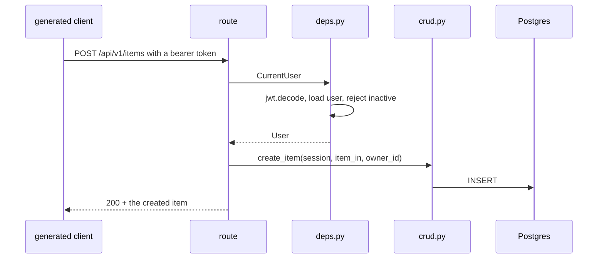

# backend-http — the FastAPI surface

**Covers:** `backend/app/main.py`, `backend/app/api/**/*.py`
**Tier:** ui
**Service:** backend
**Connects:** backend-domain via import, backend-core via import

## Purpose

Everything the backend exposes: the FastAPI application, its middleware, the five routers, and the
dependency ladder that decides who may call what.

## Topology and components

| File | Job |
|---|---|
| `main.py` | build the app, add CORS, mount `api_router` under `settings.API_V1_STR` (`:33`) |
| `api/main.py` | assemble the routers |
| `api/deps.py` | the injectable session and the authentication ladder |
| `api/routes/` | the five route modules: login, users, items, utils, private |

## The route surface

Every route, mounted under `settings.API_V1_STR`. Read off the decorators at `0.9.0`, and worth
enumerating because it is the contract the generated client is built from.

| Router | Routes |
|---|---|
| `login` (no prefix) | `POST /login/access-token` · `POST /login/test-token` · `POST /password-recovery/{email}` · `POST /reset-password/` · `POST /password-recovery-html-content/{email}` |
| `/users` | `GET /` · `POST /` · `POST /signup` · `GET /me` · `PATCH /me` · `DELETE /me` · `PATCH /me/password` · `GET /{user_id}` · `PATCH /{user_id}` · `DELETE /{user_id}` |
| `/items` | `GET /` · `POST /` · `GET /{id}` · `PUT /{id}` · `DELETE /{id}` |
| `/utils` | `GET /health-check/` · `POST /test-email/` |
| `/private` | local environment only — see below |

**The `/users/me` group exists so a user is not an id.** `GET /me` and `PATCH /me` take no identifier;
the caller is whoever the token says. That is what keeps `GET /{user_id}` behind
`get_current_active_superuser` without also locking a user out of their own profile.

## Key abstractions

**Authorisation is a parameter type.** `deps.py` exposes `SessionDep`, `CurrentUser` (`:30`) and
`get_current_active_superuser` (`:52`). A route asks for the level it needs and FastAPI supplies it; no
middleware and no decorator table decides access. The practical consequence is that the authorisation for
an endpoint is readable from its signature without leaving the file.

**The route surface depends on the environment.** `api/main.py:13` mounts `private.router` only when
`ENVIRONMENT == "local"`. Four routers are always present; the fifth exists only in development.

**CORS is configured, never wildcarded.** `main.py:25` passes `allow_origins=settings.all_cors_origins` —
a list assembled from configuration — together with `allow_credentials=True`. That pairing is why the
wildcard is absent rather than merely unused: browsers reject `*` when credentials are sent, so a
wildcard here would silently break the frontend rather than loosen it.

## State and tiering

None of its own. Sessions come from `backend-core`'s engine through `get_db`.

## Key flows

_**What to notice:** the token is decoded in `deps.py:30` before the route body runs, so a route that
declares `CurrentUser` cannot execute for an unauthenticated caller — the check is not something the
handler can forget. The cost is that authorisation failures surface as dependency errors, not as branches
inside the handler._

## Invariants

- HTTP-001 (proposed) — a route that mutates data must declare `CurrentUser` or a stricter dependency.
  Not mechanically checked; the DSL cannot express "this parameter type appears in this signature".
