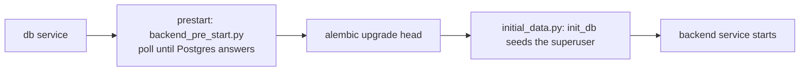

# backend-ops — migrations and start-up ordering

**Covers:** `backend/app/alembic/**/*.py`, `backend/app/backend_pre_start.py`, `backend/app/initial_data.py`, `backend/app/tests_pre_start.py`
**Tier:** infra
**Service:** backend
**Connects:** backend-core via import, backend-domain via import

## Purpose

The scripts that run before the API serves traffic: wait for Postgres, apply migrations, seed the first
superuser.

## Key abstractions

**Ordering is expressed in compose, not in code.** The `prestart` service runs to completion before
`backend` starts, which is why `main.py` contains no readiness check — the API can assume the database is
up and migrated because it is not started until that is true.

**The two pre-start scripts are the same shape.** Each polls `core.db.engine` until a trivial
query succeeds. `tests_pre_start.py` exists separately so the test run has its own wait without importing
the production seeding path.

## Key flows

_**What to notice:** seeding runs after migrations and before the API exists, so `init_db`'s call into
`crud.create_user` happens with no HTTP server running. That is why an upward import from `core` to
`crud` (`core/db.py:3`) costs nothing at request time — it is only exercised once, at start-up._

## Invariants

- OPS-001 (proposed) — the API must not start before migrations have run. Enforced by compose service
  ordering, not by code.
